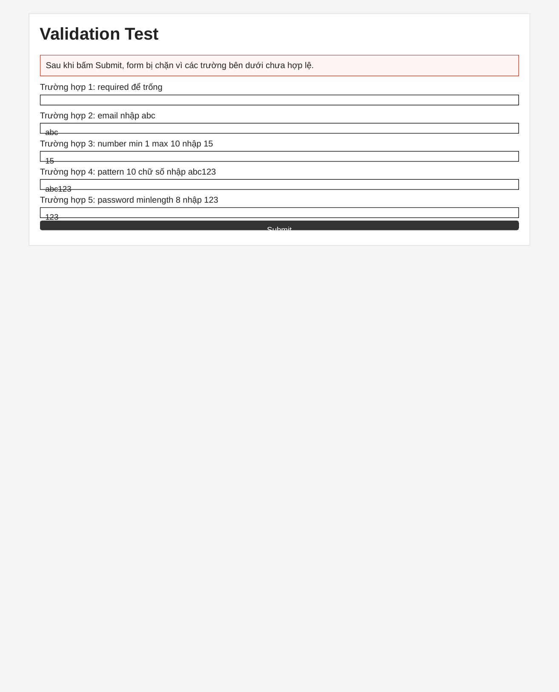
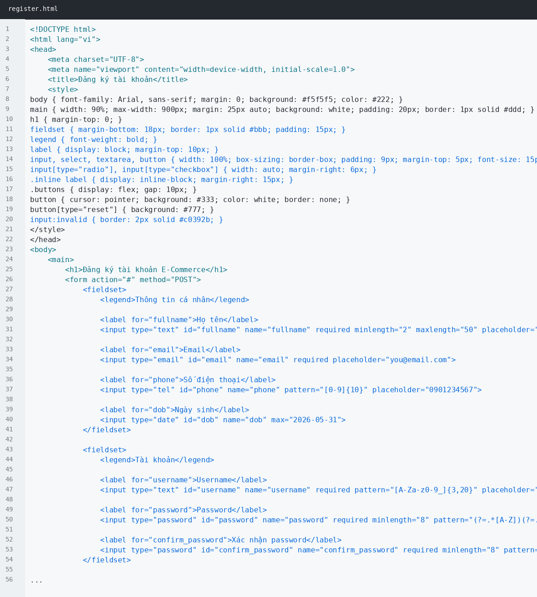
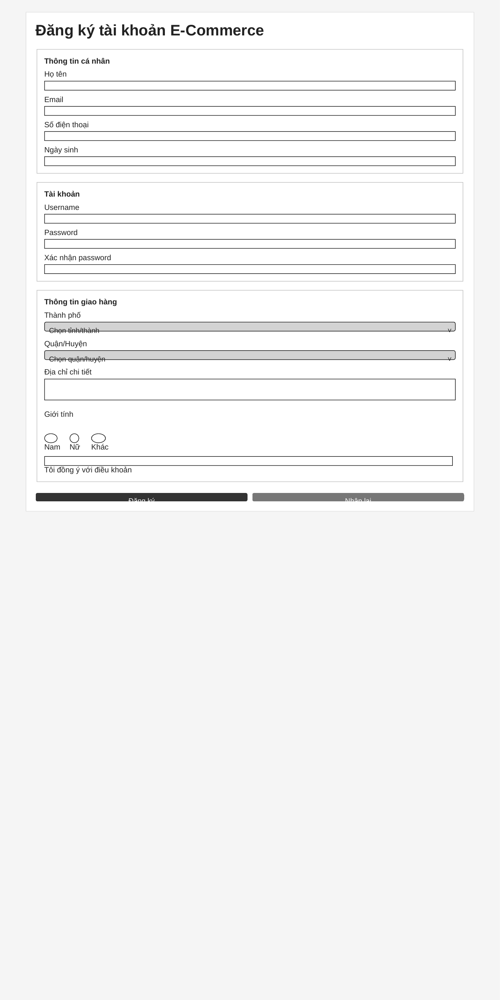
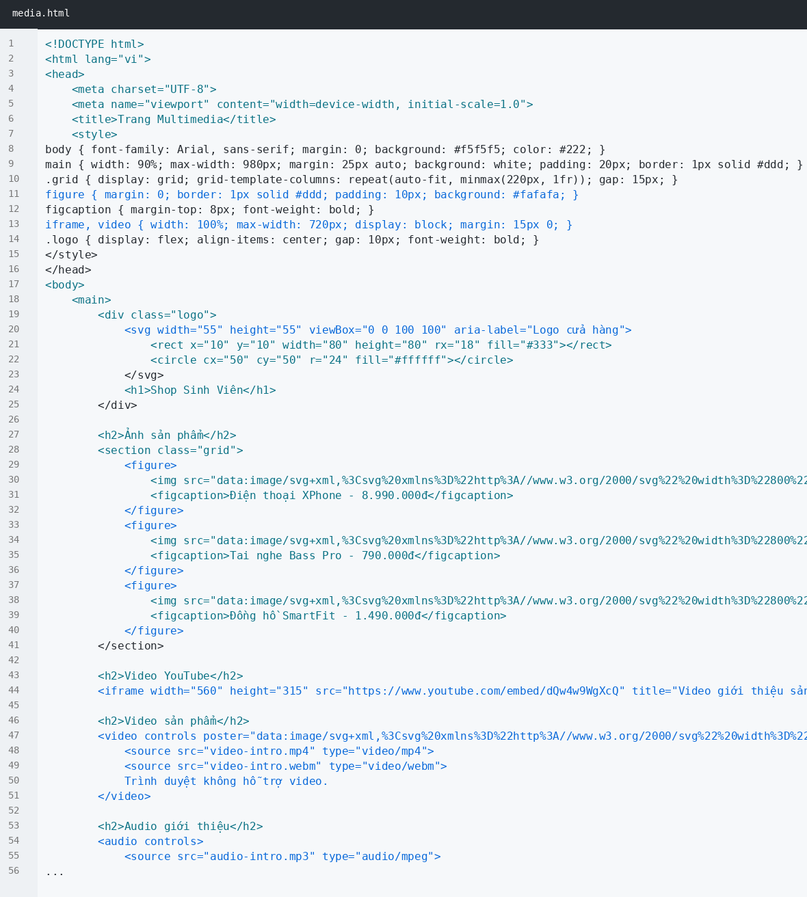
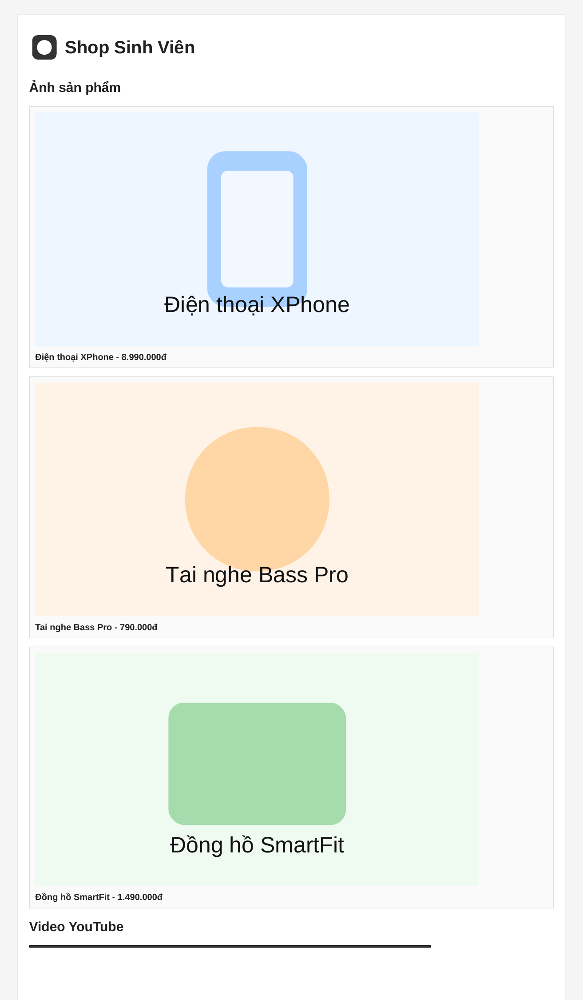
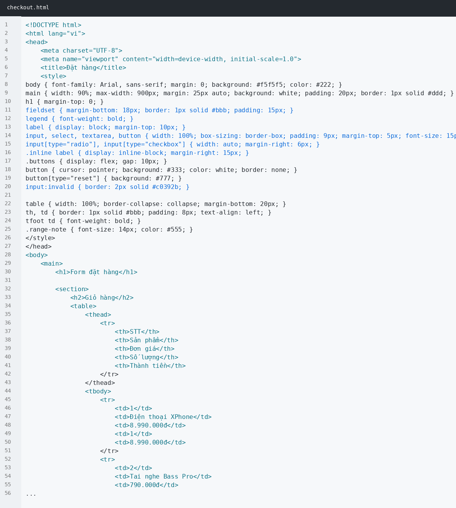
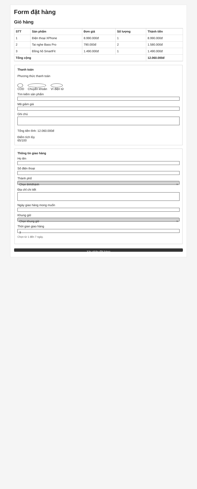

# PHIẾU BÀI TẬP 02

Sinh viên: Nguyễn Quang Thực

## PHẦN A — KIỂM TRA ĐỌC HIỂU

### Câu A1 — Input Types

1. `type="email"` → Ô nhập email, tự kiểm tra định dạng có dạng email → Dùng cho đăng ký tài khoản.
2. `type="password"` → Ô nhập bị che ký tự, không hiện mật khẩu trực tiếp → Dùng cho đăng nhập và đăng ký.
3. `type="text"` → Ô nhập chữ bình thường, không có validation đặc biệt → Dùng nhập họ tên, địa chỉ.
4. `type="tel"` → Ô nhập số điện thoại, thường hiện bàn phím số trên điện thoại → Dùng nhập số điện thoại nhận hàng.
5. `type="number"` → Ô nhập số, có thể dùng `min`, `max` → Dùng nhập số lượng sản phẩm.
6. `type="date"` → Ô chọn ngày, có thể giới hạn ngày bằng `min`, `max` → Dùng chọn ngày sinh hoặc ngày giao hàng.
7. `type="radio"` → Nút chọn một trong nhiều lựa chọn → Dùng chọn giới tính hoặc phương thức thanh toán.
8. `type="checkbox"` → Ô tích chọn, có thể bắt buộc bằng `required` → Dùng đồng ý điều khoản.
9. `type="search"` → Ô tìm kiếm, giống text nhưng dành cho tìm kiếm → Dùng tìm sản phẩm trong shop.
10. `type="range"` → Thanh trượt chọn giá trị → Dùng chọn thời gian giao hàng từ 1 đến 7 ngày.

### Câu A2 — Validation Attributes

1. Trường hợp 1: `required` mà để trống nên trình duyệt chặn submit vì đây là trường bắt buộc.
2. Trường hợp 2: `type="email"` nhập `abc` nên bị báo lỗi vì không đúng định dạng email.
3. Trường hợp 3: `type="number"` có `min="1"` và `max="10"`, nhập 15 nên bị lỗi vì vượt quá max.
4. Trường hợp 4: `pattern="[0-9]{10}"`, nhập `abc123` nên bị lỗi vì không phải đúng 10 chữ số.
5. Trường hợp 5: `minlength="8"`, nhập `123` nên bị lỗi vì chưa đủ 8 ký tự.

Kết quả chạy thực tế trong `validation_test.html`:



So sánh: Kết quả thực tế giống dự đoán. Khi bấm Submit, trình duyệt không gửi form mà báo lỗi ở trường chưa hợp lệ. Các trường sai định dạng, sai min/max, sai pattern hoặc thiếu độ dài đều bị chặn.

### Câu A3 — Accessibility

`<label for="email">` quan trọng vì nó liên kết phần chữ mô tả với đúng ô nhập. Người dùng screen reader biết ô đó dùng để nhập gì. Khi click vào label, con trỏ cũng tự focus vào input nên dễ dùng hơn.

Dùng `<fieldset>` và `<legend>` khi form có nhiều nhóm thông tin. Ví dụ form đăng ký có nhóm “Thông tin cá nhân”, “Tài khoản”, “Thông tin giao hàng”. Nó giúp form rõ ràng và dễ hiểu hơn.

`aria-label` dùng khi phần tử không có chữ hiển thị rõ ràng, ví dụ nút chỉ có icon tìm kiếm. Không nên dùng `aria-label` khi đã có `<label>` vì có thể làm nội dung bị trùng hoặc lệch so với chữ người dùng đang nhìn thấy.

### Câu A4 — Media

`loading="lazy"` trên `` giúp ảnh chỉ tải khi gần xuất hiện trên màn hình. Nó giúp trang tải nhanh hơn, nhất là trang có nhiều ảnh sản phẩm. Không nên dùng cho ảnh quan trọng ở đầu trang vì có thể làm ảnh chính hiện chậm.

Nên cung cấp nhiều `<source>` trong `<video>` để nhiều trình duyệt có thể chọn format phù hợp. Một số format video web phổ biến là MP4, WebM và Ogg.

`alt` dùng để mô tả nội dung ảnh cho screen reader và khi ảnh bị lỗi tải.

- Ảnh sản phẩm iPhone 16: `alt="iPhone 16 màu đen, mặt trước và mặt sau"`
- Ảnh trang trí: `alt=""`
- Ảnh biểu đồ doanh thu Q1/2026: `alt="Biểu đồ doanh thu Q1 năm 2026 tăng qua từng tháng"`

### Câu A5 — So sánh `<figure>` và ``

Dùng `` khi chỉ cần hiển thị ảnh đơn giản, không cần chú thích đi kèm.

Ví dụ:

1. Ảnh icon giỏ hàng trên header.
2. Ảnh banner nhỏ trang trí trong trang chủ.

Dùng `<figure>` khi ảnh cần đi kèm chú thích hoặc thông tin giải thích.

Ví dụ:

1. Ảnh sản phẩm kèm tên sản phẩm và giá.
2. Ảnh biểu đồ doanh thu kèm chú thích “Doanh thu Q1/2026”.

## PHẦN B — ẢNH DẪN CHỨNG CODE VÀ GIAO DIỆN

### B1 — register.html





### B2 — media.html





### B3 — checkout.html





## PHẦN C — PHÂN TÍCH & SUY LUẬN

### Câu C1 — Debug Form

Lỗi 1: Input “Tên” không có `<label for="...">`, không có `id`, `name`, `required`.

Sửa: `<label for="name">Tên:</label> <input type="text" id="name" name="name" required placeholder="Nhập họ tên">`

Lỗi 2: Input email không có label liên kết bằng `for`.

Sửa: `<label for="email">Email:</label> <input type="email" id="email" name="email" required placeholder="Email của bạn">`

Lỗi 3: Email không có `required`, người dùng có thể bỏ trống.

Sửa: thêm `required` cho input email.

Lỗi 4: Password không có label, không có `id`, `name`, `required`, `minlength`.

Sửa: `<label for="password">Mật khẩu:</label> <input type="password" id="password" name="password" required minlength="8" placeholder="Mật khẩu">`

Lỗi 5: Nhập lại mật khẩu không có label và không có validation cơ bản.

Sửa: `<label for="confirm_password">Nhập lại mật khẩu:</label> <input type="password" id="confirm_password" name="confirm_password" required minlength="8" placeholder="Nhập lại mật khẩu">`

Lỗi 6: Phone dùng `type="text"`, nên dùng `type="tel"` và pattern 10 số.

Sửa: `<label for="phone">Phone:</label> <input type="tel" id="phone" name="phone" pattern="[0-9]{10}" required placeholder="0901234567">`

Lỗi 7: `<select>` không có label, id, name và option mặc định.

Sửa: `<label for="city">Thành phố:</label> <select id="city" name="city" required><option value="">Chọn thành phố</option><option value="ha-noi">Hà Nội</option><option value="tp-hcm">TP.HCM</option></select>`

Lỗi 8: Label “Tôi đồng ý điều khoản” không có checkbox thật để người dùng tích chọn.

Sửa: `<label for="agree"><input type="checkbox" id="agree" name="agree" required> Tôi đồng ý điều khoản</label>`

Form sau khi sửa:

```html
<form action="#" method="POST">
    <label for="name">Tên:</label>
    <input type="text" id="name" name="name" required placeholder="Nhập họ tên">

    <label for="email">Email:</label>
    <input type="email" id="email" name="email" required placeholder="Email của bạn">

    <label for="password">Mật khẩu:</label>
    <input type="password" id="password" name="password" required minlength="8" placeholder="Mật khẩu">

    <label for="confirm_password">Nhập lại mật khẩu:</label>
    <input type="password" id="confirm_password" name="confirm_password" required minlength="8" placeholder="Nhập lại mật khẩu">

    <label for="phone">Phone:</label>
    <input type="tel" id="phone" name="phone" pattern="[0-9]{10}" required placeholder="0901234567">

    <label for="city">Thành phố:</label>
    <select id="city" name="city" required>
        <option value="">Chọn thành phố</option>
        <option value="ha-noi">Hà Nội</option>
        <option value="tp-hcm">TP.HCM</option>
    </select>

    <label for="agree">
        <input type="checkbox" id="agree" name="agree" required>
        Tôi đồng ý điều khoản
    </label>

    <button type="submit">Gửi</button>
</form>
```

### Câu C2 — Thiết kế chiến lược Validation

Pattern CMND/CCCD đúng 12 chữ số:

```html
pattern="[0-9]{12}"
```

Pattern số tài khoản 10 đến 15 chữ số:

```html
pattern="[0-9]{10,15}"
```

HTML5 validation chưa đủ an toàn cho ứng dụng ngân hàng. Nó chỉ kiểm tra ở trình duyệt, người dùng vẫn có thể sửa HTML, tắt validation hoặc gửi request trực tiếp lên server.

3 loại validation HTML5 không thể làm đầy đủ:

1. Kiểm tra mật khẩu nhập lại có giống mật khẩu ban đầu không.
2. Kiểm tra email hoặc số CCCD đã tồn tại trong hệ thống chưa.
3. Kiểm tra dữ liệu theo API ngân hàng, ví dụ tài khoản có thật hay không.

2 rủi ro nếu chỉ validate Frontend:

1. Kẻ xấu có thể gửi dữ liệu sai định dạng trực tiếp lên Backend.
2. Có thể gây lỗi hệ thống hoặc lưu dữ liệu bẩn nếu Backend không kiểm tra lại.

Trong bài B1, HTML không thể tự kiểm tra “xác nhận password” có giống password không. HTML chỉ kiểm tra từng input riêng lẻ bằng `required`, `pattern`, `minlength`. Muốn so sánh hai ô mật khẩu thì phải dùng JavaScript hoặc Backend.
