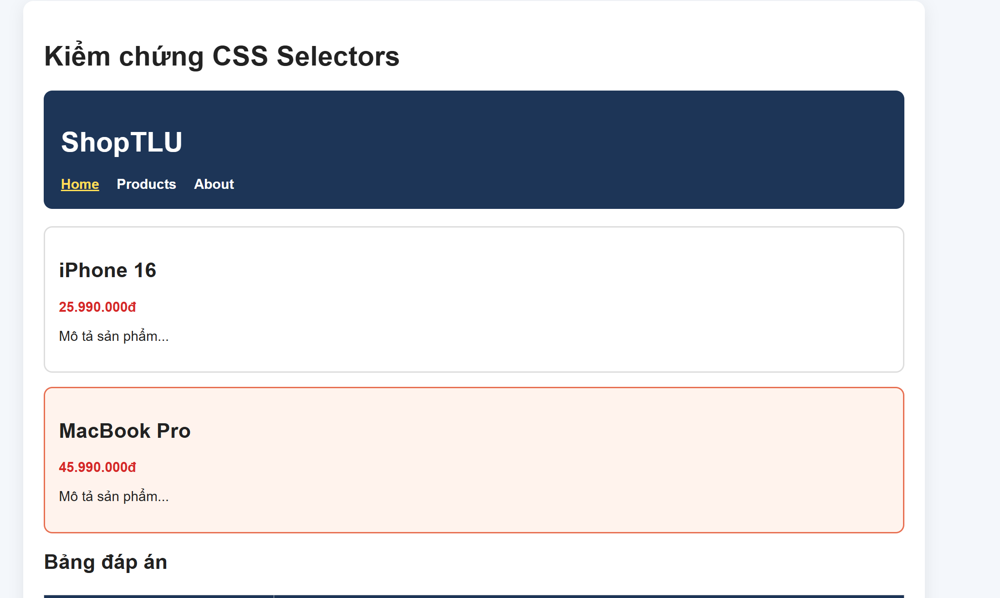
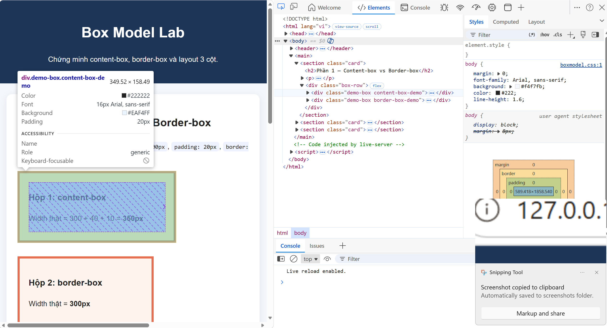
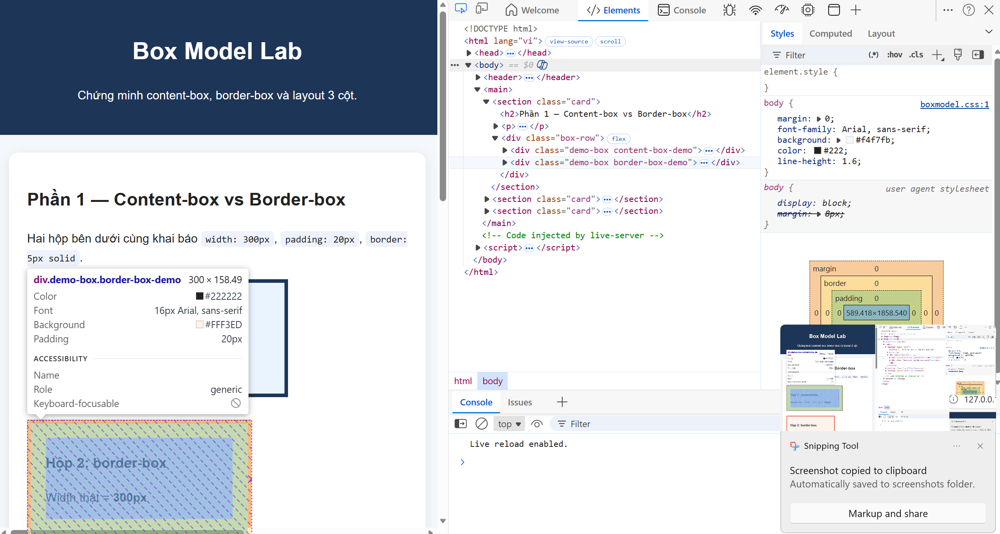
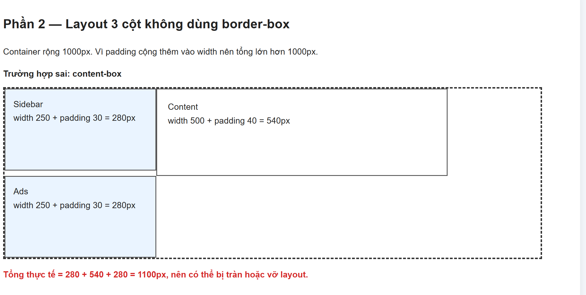
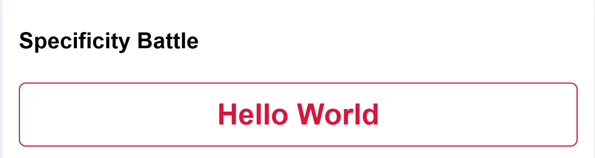
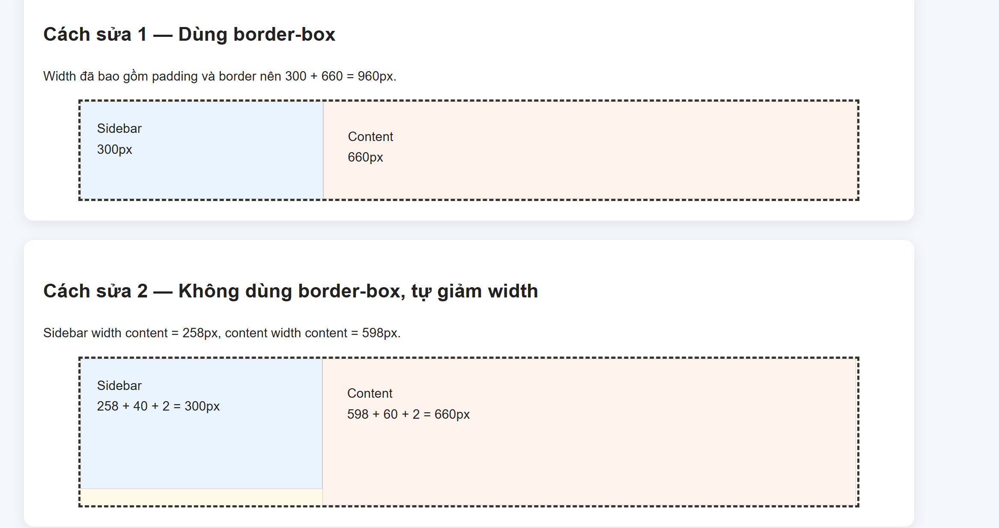
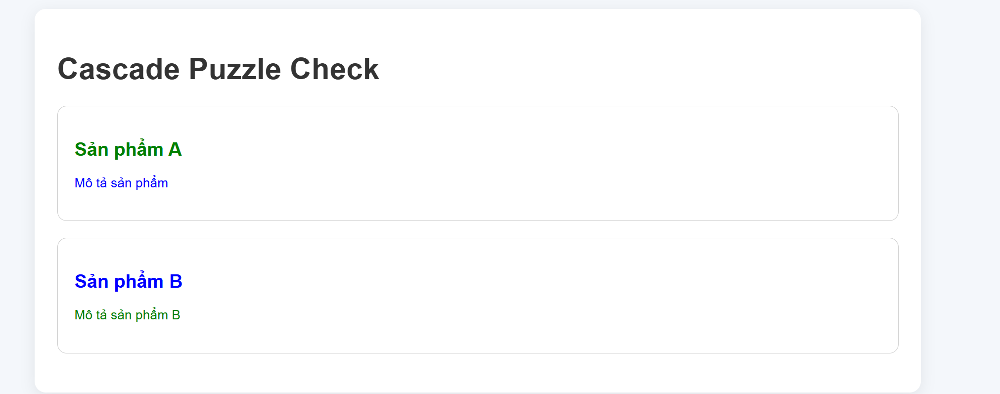

# answers.md — PBT 03 CSS Core

## PHẦN A — KIỂM TRA ĐỌC HIỂU

## Câu A1 — 3 cách nhúng CSS

**Nguồn:** `tuan_2_css_core/08_introduction_css.md` — phần cách nhúng CSS.

| Cách | Ví dụ | Ưu điểm | Nhược điểm | Khi dùng |
|---|---|---|---|---|
| Inline CSS | `<p style="color:red;">Xin chào</p>` | Nhanh, dễ thử | Khó bảo trì, không tái sử dụng | Test nhanh hoặc sửa 1 element |
| Internal CSS | `<style>p { color: blue; }</style>` | Áp dụng được trong 1 trang | Khó dùng lại cho nhiều trang | Trang nhỏ, demo |
| External CSS | `<link rel="stylesheet" href="style.css">` | Dễ quản lý, tái sử dụng tốt | Cần liên kết đúng file CSS | Nên dùng cho website thực tế |

Nếu cùng 1 element có inline, internal và external CSS cùng áp dụng, **inline CSS thắng** vì có độ ưu tiên cao hơn CSS trong `<style>` và file `.css`. Nếu có `!important` thì rule có `!important` có thể thắng rule thường.

---

## Câu A2 — CSS Selectors

**Nguồn:** `tuan_2_css_core/09_css_selectors.md` — phần selectors.

| STT | Selector | Chọn được element nào? |
|---|---|---|
| 1 | `h1` | `ShopTLU` |
| 2 | `.price` | `25.990.000đ`, `45.990.000đ` |
| 3 | `#app header` | Header chứa: `ShopTLU Home Products About` |
| 4 | `nav a:first-child` | `Home` |
| 5 | `.product.featured h2` | `MacBook Pro` |
| 6 | `article > p` | `25.990.000đ`, `Mô tả sản phẩm...`, `45.990.000đ`, `Mô tả sản phẩm...` |
| 7 | `a[href="/"]` | `Home` |
| 8 | `.top-bar.dark h1` | `ShopTLU` |

File kiểm chứng: `selectors_test.html`.

Ảnh kiểm chứng:



---

## Câu A3 — Box Model

**Nguồn:** `tuan_2_css_core/11_box_model.md` — phần Box Model, `box-sizing`, margin collapse.

### Trường hợp 1: `content-box`

```css
.box-1 {
    width: 400px;
    padding: 20px;
    border: 5px solid black;
    margin: 10px;
}
```

Chiều rộng hiển thị:

```text
400 + 20 + 20 + 5 + 5 = 450px
```

Không gian chiếm trên trang:

```text
450 + 10 + 10 = 470px
```

**Kết quả:** chiều rộng hiển thị `450px`, không gian chiếm `470px`.

### Trường hợp 2: `border-box`

```css
.box-2 {
    box-sizing: border-box;
    width: 400px;
    padding: 20px;
    border: 5px solid black;
    margin: 10px;
}
```

Với `border-box`, `width: 400px` đã gồm content + padding + border.

Kích thước content thực tế:

```text
400 - 20 - 20 - 5 - 5 = 350px
```

Không gian chiếm trên trang:

```text
400 + 10 + 10 = 420px
```

**Kết quả:** chiều rộng hiển thị `400px`, content thực tế `350px`, không gian chiếm `420px`.

### Trường hợp 3: Margin collapse

```css
.box-a { margin-bottom: 25px; }
.box-b { margin-top: 40px; }
```

Khoảng cách giữa 2 box là **40px**, không phải `65px`, vì margin dọc liền kề bị collapse và trình duyệt lấy margin lớn hơn.

Nâng cao:

```css
.box-a { margin-bottom: -10px; }
.box-b { margin-top: 40px; }
```

Khoảng cách:

```text
40 + (-10) = 30px
```

**Kết quả:** `30px`.

---

## Câu A4 — Specificity

**Nguồn:** `tuan_2_css_core/10_cascade_specificity.md` — phần specificity, cascade, inline style, `!important`.

Target:

```html
<p class="price" id="main-price">...</p>
```

| Rule | CSS | Specificity `(a,b,c)` |
|---|---|---|
| A | `p { color: black; }` | `(0,0,1)` |
| B | `.price { color: blue; }` | `(0,1,0)` |
| C | `#main-price { color: red; }` | `(1,0,0)` |
| D | `p.price { color: green; }` | `(0,1,1)` |

Element có màu **red** vì `#main-price` có specificity cao nhất.

Nếu thêm inline style:

```html
<p class="price" id="main-price" style="color: orange;">...</p>
```

Element có màu **orange** vì inline style ưu tiên hơn rule CSS thường.

Nếu Rule A thêm `!important`:

```css
p { color: black !important; }
```

Element có màu **black** vì `!important` thắng các declaration thường. Nếu inline style cũng có `!important` thì inline important thắng.

---

# PHẦN B — THỰC HÀNH CODE

## Bài B1 — Style trang Profile

File đã tạo: `profile.html`, `style.css`.

Các selector đã dùng:

| Loại selector | Ví dụ |
|---|---|
| Element selector | `body`, `header`, `footer`, `table` |
| Class selector | `.nav-link`, `.active`, `.profile-card` |
| ID selector | `#about`, `#skills`, `#contact` |
| Descendant selector | `header p`, `.profile-card h2` |
| Pseudo-class | `.nav-link:hover`, `tr:hover`, `tr:nth-child(even)` |

---

## Bài B2 — Box Model Lab

File đã tạo: `boxmodel_lab.html`, `boxmodel.css`.

Hộp 1 `content-box`:

```text
300 + 20 + 20 + 5 + 5 = 350px
```

Ảnh DevTools hộp content-box:



Hộp 2 `border-box`:

```text
300px
```

Ảnh DevTools hộp border-box:



Giải thích: `content-box` cộng padding và border ra ngoài width, còn `border-box` giữ tổng chiều rộng đúng bằng width đã khai báo.

Layout 3 cột:

- Không dùng `border-box`: tổng chiều rộng bị lớn hơn `1000px` vì padding cộng thêm vào width.
- Dùng `border-box`: tổng đúng `250 + 500 + 250 = 1000px`.

Ảnh kiểm chứng layout 3 cột:



---

## Bài B3 — Specificity Battle

File đã tạo: `specificity.html`, `specificity.css`.

| STT | Rule | Specificity | Màu |
|---|---|---|---|
| 1 | `p` | `(0,0,1)` | black |
| 2 | `.text` | `(0,1,0)` | blue |
| 3 | `.highlight` | `(0,1,0)` | green |
| 4 | `p.text` | `(0,1,1)` | purple |
| 5 | `p.highlight` | `(0,1,1)` | brown |
| 6 | `.text.highlight` | `(0,2,0)` | orange |
| 7 | `body p.text.highlight` | `(0,2,2)` | teal |
| 8 | `#demo` | `(1,0,0)` | red |
| 9 | `p#demo` | `(1,0,1)` | navy |
| 10 | `p#demo.text.highlight` | `(1,2,1)` | crimson |

Element cuối cùng hiển thị màu **crimson** vì rule `p#demo.text.highlight` có specificity cao nhất `(1,2,1)`.

Nếu đổi thứ tự rule, kết quả **không đổi** khi specificity khác nhau. Thứ tự chỉ quyết định khi các rule có cùng specificity.

Ảnh kết quả Specificity Battle:



---

# PHẦN C — DEBUG & SUY LUẬN

## Câu C1 — Debug CSS Layout

**Nguồn:** `tuan_2_css_core/11_box_model.md` — phần content-box và border-box.

CSS ban đầu dùng `content-box`.

Sidebar:

```text
300 + 20 + 20 + 1 + 1 = 342px
```

Content:

```text
660 + 30 + 30 + 1 + 1 = 722px
```

Tổng:

```text
342 + 722 = 1064px
```

Container chỉ rộng `960px`, nên `.content` bị đẩy xuống dòng mới.

### Cách sửa 1: Dùng `border-box`

```css
* {
    box-sizing: border-box;
}

.sidebar {
    width: 300px;
    padding: 20px;
    border: 1px solid #ccc;
    float: left;
}

.content {
    width: 660px;
    padding: 30px;
    border: 1px solid #ccc;
    float: left;
}
```

Tổng chiều rộng:

```text
300 + 660 = 960px
```

### Cách sửa 2: Không dùng `border-box`

Giảm width để sau khi cộng padding và border vẫn vừa `960px`.

```css
.sidebar {
    width: 258px;
    padding: 20px;
    border: 1px solid #ccc;
    float: left;
}

.content {
    width: 598px;
    padding: 30px;
    border: 1px solid #ccc;
    float: left;
}
```

Tính lại:

```text
Sidebar: 258 + 40 + 2 = 300px
Content: 598 + 60 + 2 = 660px
Tổng: 300 + 660 = 960px
```

File chứng minh: `debug_layout.html`, `debug_layout.css`.

Ảnh kiểm chứng 2 cách sửa layout:



---

## Câu C2 — Cascade Puzzle

**Nguồn:** `tuan_2_css_core/10_cascade_specificity.md` — phần cascade, inheritance, `!important`.

### 1. `Sản phẩm A`

```html
<h2 class="title highlight">Sản phẩm A</h2>
```

**Font-size:** `20px`  
**Color:** `green`

Vì `.card .title` đặt `font-size: 20px`. Màu `red` từ `#featured .title` bị ghi đè bởi `.highlight { color: green !important; }`.

### 2. `Mô tả sản phẩm`

```html
<p>Mô tả sản phẩm</p>
```

**Color:** `blue`

Vì `p` nằm trong `.card`, `.card` có `color: blue`; rule `.card p { color: inherit; }` làm `p` kế thừa màu từ `.card`.

### 3. `Sản phẩm B`

```html
<h2 class="title">Sản phẩm B</h2>
```

**Font-size:** `20px`  
**Color:** `blue`

Vì `.card .title` đặt `font-size: 20px`, còn màu được kế thừa từ `.card { color: blue; }`.

### 4. `Mô tả sản phẩm B`

```html
<p class="highlight">Mô tả sản phẩm B</p>
```

**Color:** `green`

Vì `.highlight { color: green !important; }` thắng `.card p { color: inherit; }`.

File kiểm chứng: `cascade_check.html`, `cascade_check.css`.

Ảnh kiểm chứng Cascade Puzzle:


