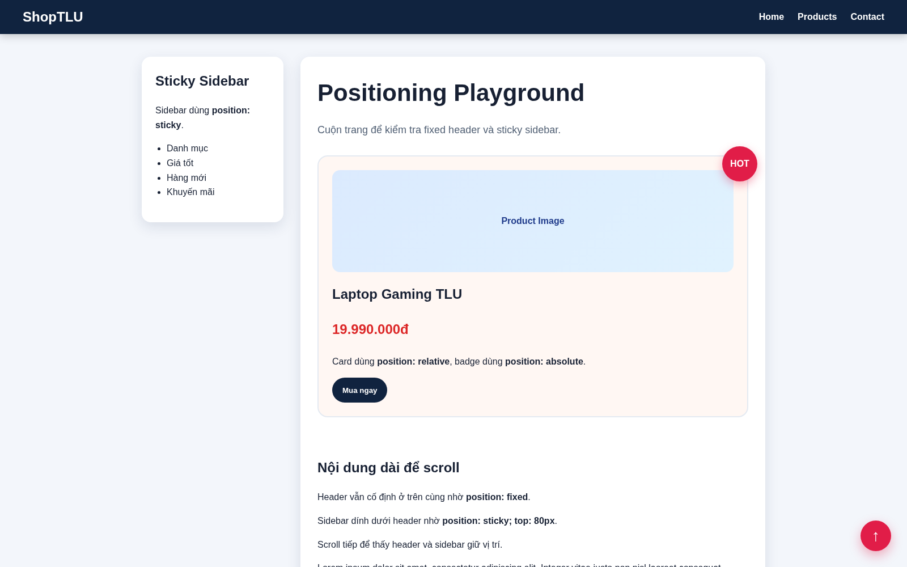
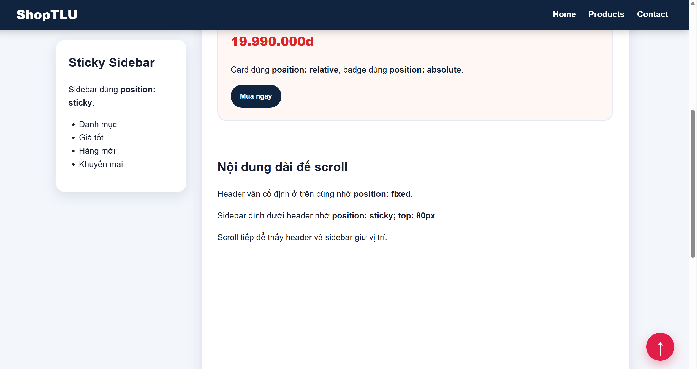
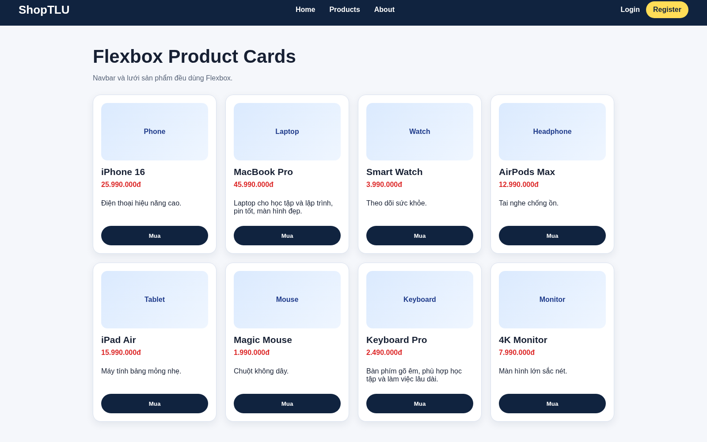
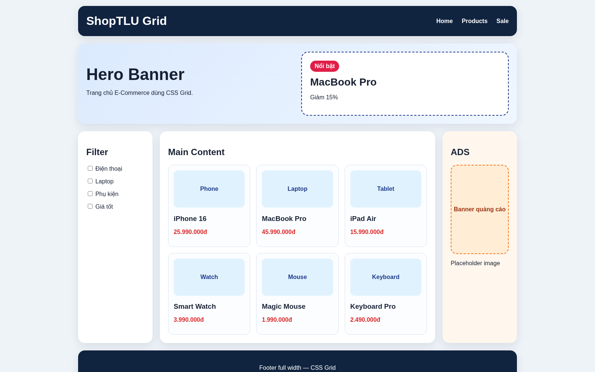
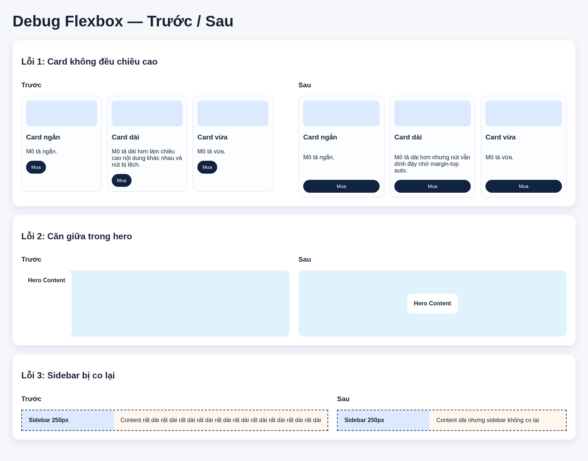

# PBT04 — CSS Layout

## PHẦN A — KIỂM TRA ĐỌC HIỂU

### Câu A1 — 5 loại Positioning

| Position | Vẫn chiếm chỗ trong flow? | Tham chiếu vị trí | Cuộn theo trang? | Use case |
|---|---|---|---|---|
| `static` | Có | Theo normal flow, không dùng `top/right/bottom/left` | Có | Bố cục mặc định |
| `relative` | Có | Vị trí ban đầu của chính nó | Có | Dịch nhẹ element, làm parent cho absolute |
| `absolute` | Không | Nearest positioned ancestor | Có, theo trang/khối cha | Badge, dropdown, overlay |
| `fixed` | Không | Viewport trình duyệt | Không, luôn cố định trên màn hình | Header fixed, nút back-to-top |
| `sticky` | Có | Scroll container/viewport gần nhất, theo ngưỡng `top` | Ban đầu có, đến ngưỡng thì dính lại | Sidebar sticky, tiêu đề bảng sticky |

**Absolute tham chiếu body khi nào?**  
Khi element `absolute` không tìm thấy ancestor nào có `position` khác `static`, nó sẽ tham chiếu theo viewport/body.

**Absolute tham chiếu parent khi nào?**  
Khi parent hoặc ancestor gần nhất có `position: relative`, `absolute`, `fixed` hoặc `sticky`.

**Nearest positioned ancestor:** ancestor gần nhất có `position` khác `static`. Element `absolute` sẽ lấy ancestor này làm mốc để đặt `top/right/bottom/left`.

---

### Câu A2 — Flexbox vs Grid

#### Trường hợp 1

```css
.container { display: flex; }
.item { flex: 1; }
```

4 items nằm trên 1 hàng, mỗi item rộng bằng nhau.

```text
| item 1 | item 2 | item 3 | item 4 |
```

#### Trường hợp 2

```css
.container { display: flex; flex-wrap: wrap; }
.item { width: 45%; margin: 2.5%; }
```

Mỗi item chiếm 50% hàng: `45% + 2.5% trái + 2.5% phải = 50%`. 6 items thành 3 hàng, mỗi hàng 2 cột.

```text
| item 1 | item 2 |
| item 3 | item 4 |
| item 5 | item 6 |
```

#### Trường hợp 3

```css
.container { display: flex; justify-content: space-between; align-items: center; }
```

3 items nằm trên 1 hàng, cách đều theo chiều ngang. Theo chiều dọc được căn giữa.

```text
| item 1        item 2        item 3 |
```

#### Trường hợp 4

```css
.container { display: grid; grid-template-columns: 200px 1fr 200px; gap: 20px; }
```

Có 3 cột: cột trái 200px, cột giữa chiếm phần còn lại, cột phải 200px. Giữa các cột có gap 20px.

```text
| 200px |        1fr        | 200px |
```

#### Trường hợp 5

```css
.container { display: grid; grid-template-columns: repeat(3, 1fr); gap: 10px; }
```

Có 3 cột bằng nhau. 7 items thành 3 hàng, item 7 nằm ở cột đầu tiên của hàng 3.

```text
| item 1 | item 2 | item 3 |
| item 4 | item 5 | item 6 |
| item 7 |        |        |
```

---

## PHẦN B — THỰC HÀNH CODE

### Bài B1 — Positioning Playground

File đã tạo:

```text
positioning.html
positioning.css
```

Các yêu cầu đã dùng:

- Header: `position: fixed`, cao 60px, full width.
- Sidebar: `position: sticky; top: 80px`.
- Product card: `position: relative`.
- Badge HOT: `position: absolute`, góc phải trên card.
- Scroll to top button: `position: fixed`, góc phải dưới.

Ảnh chụp:





---

### Bài B2 — Flexbox Navigation & Cards

File đã tạo:

```text
flexbox_layout.html
flexbox.css
```

Các yêu cầu đã dùng:

- Navbar dùng `display: flex`, `justify-content: space-between`, `align-items: center`.
- Menu nằm giữa bằng flex.
- Product cards dùng `display: flex; flex-wrap: wrap`.
- Card dùng `flex: 0 0 calc(25% - 20px)`.
- Bên trong card dùng `flex-direction: column`.
- Nút mua dùng `margin-top: auto` để dính đáy.
- Hover card: `transform: translateY(-5px)` và tăng `box-shadow`.

Ảnh chụp:



---

### Bài B3 — Grid Layout E-Commerce

File đã tạo:

```text
grid_layout.html
grid.css
```

Các yêu cầu đã dùng:

- Layout chính dùng CSS Grid.
- Dùng `grid-template-areas`.
- Cột chính: `200px minmax(0, 1fr) 200px`.
- Header, hero, footer span full width.
- Sidebar có checkbox filter.
- Main có grid con 3 cột cho product cards.
- Ads là banner quảng cáo.
- Có product nổi bật trong hero dùng `grid-column: span 2`.

Ảnh chụp:



---

## PHẦN C — SUY LUẬN

### Câu C1 — Flexbox vs Grid: Khi nào dùng gì?

| Tình huống | Dùng gì? | Giải thích |
|---|---|---|
| Navigation bar ngang | Flexbox | Bố cục 1 chiều theo hàng ngang, dễ căn logo, menu, button |
| Lưới ảnh Instagram 3 cột | Grid | Bố cục 2 chiều theo hàng và cột, số ảnh nhiều vẫn tự xuống hàng |
| Layout blog main + sidebar | Grid | Cần chia vùng lớn theo cột rõ ràng |
| Footer 4 cột thông tin | Grid hoặc Flexbox | 4 cột đều nhau, Grid rõ hơn; Flexbox cũng dùng được vì chỉ 1 hàng |
| Card sản phẩm ảnh/text/nút | Flexbox | Bố cục 1 chiều từ trên xuống, dùng `margin-top: auto` để nút dính đáy |

---

### Câu C2 — Debug Flexbox

#### Lỗi 1: Cards không đều chiều cao, nút “Mua” bị nhảy

**Nguyên nhân:**  
Nội dung mỗi card dài ngắn khác nhau. Card chưa dùng flex column nên nút không được đẩy xuống đáy.

**Code sửa:**

```css
.card-container {
    display: flex;
    flex-wrap: wrap;
    align-items: stretch;
    gap: 20px;
}

.card {
    flex: 0 0 calc(33.333% - 20px);
    display: flex;
    flex-direction: column;
}

.card .btn {
    margin-top: auto;
}
```

#### Lỗi 2: Muốn căn giữa ngang và dọc nhưng item vẫn ở góc trái

**Nguyên nhân:**  
`.hero` đã có `display: flex` nhưng thiếu `justify-content` và `align-items`.

**Code sửa:**

```css
.hero {
    height: 100vh;
    display: flex;
    justify-content: center;
    align-items: center;
}

.hero-content {
    text-align: center;
}
```

#### Lỗi 3: Sidebar bị co lại khi content quá dài

**Nguyên nhân:**  
Flex item mặc định có `flex-shrink: 1`, nên sidebar có thể bị co lại.

**Code sửa:**

```css
.layout {
    display: flex;
}

.sidebar {
    flex: 0 0 250px;
}

.content {
    flex: 1;
    min-width: 0;
}
```

Ảnh chụp trước/sau:


