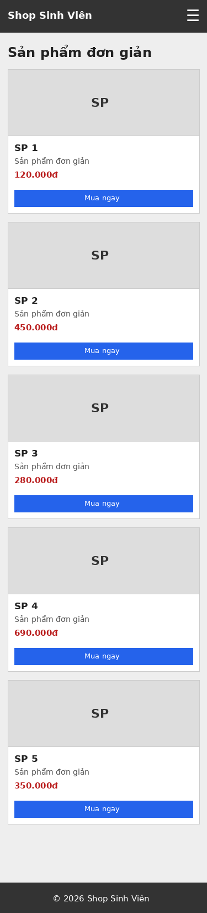
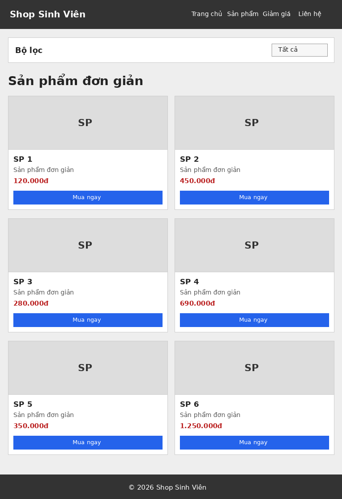
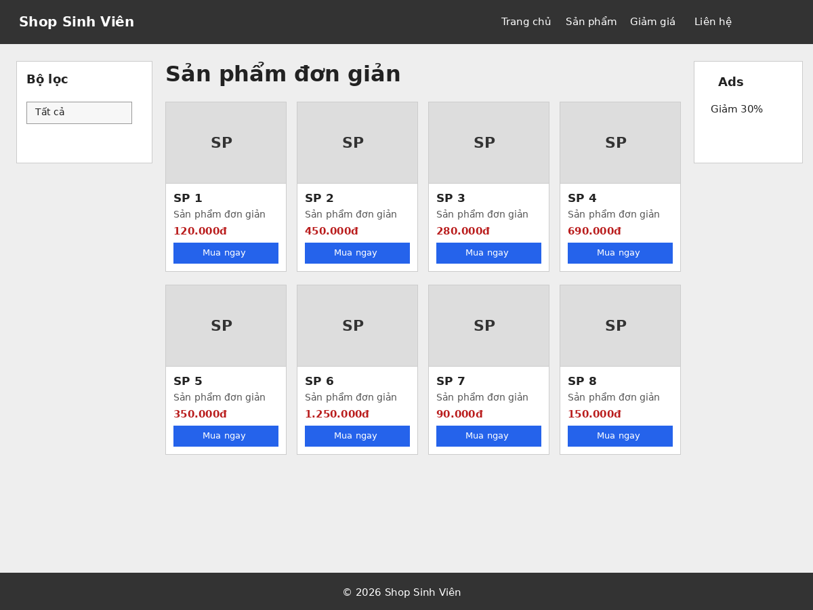
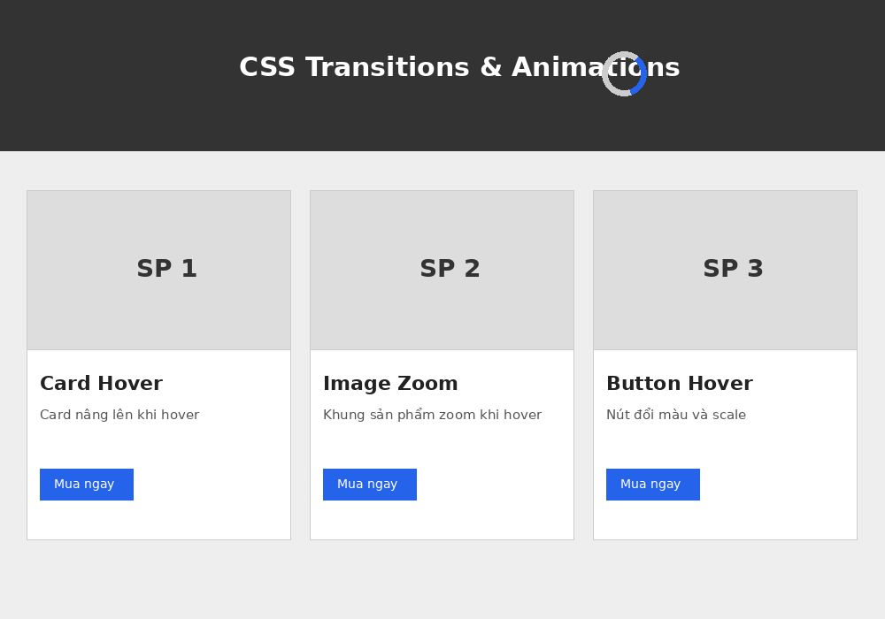
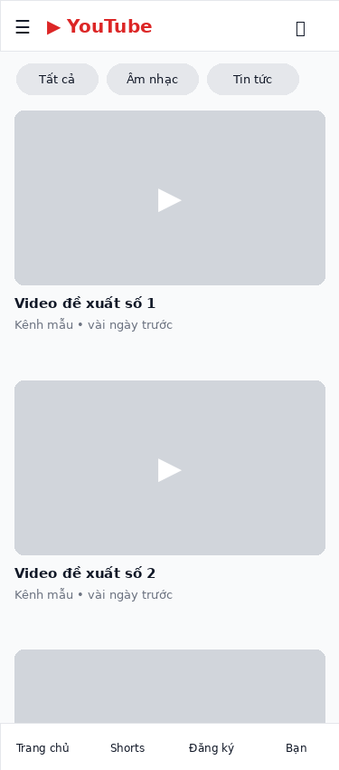
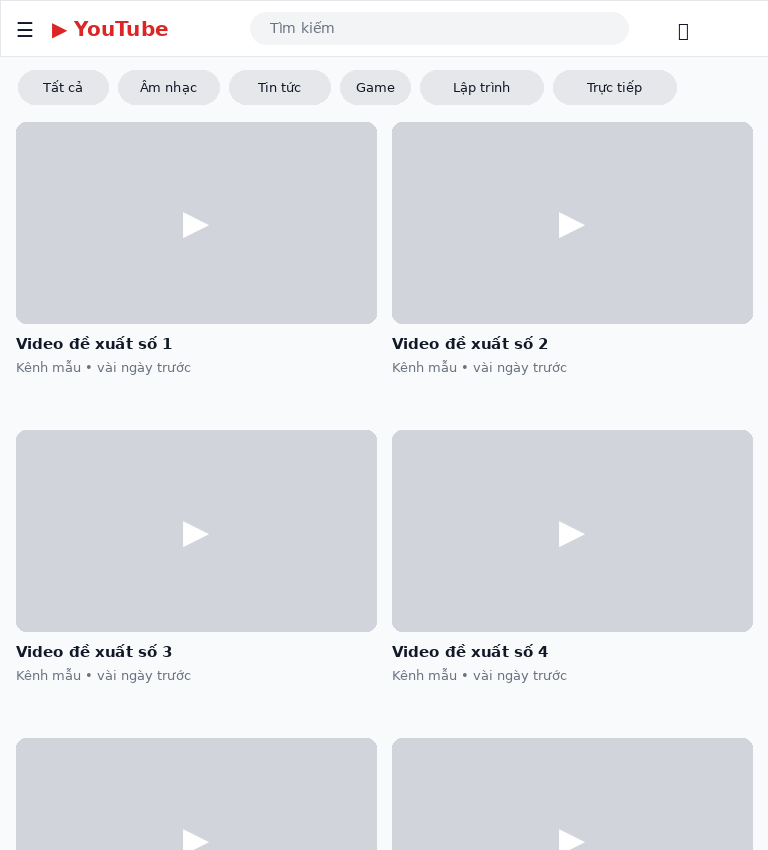
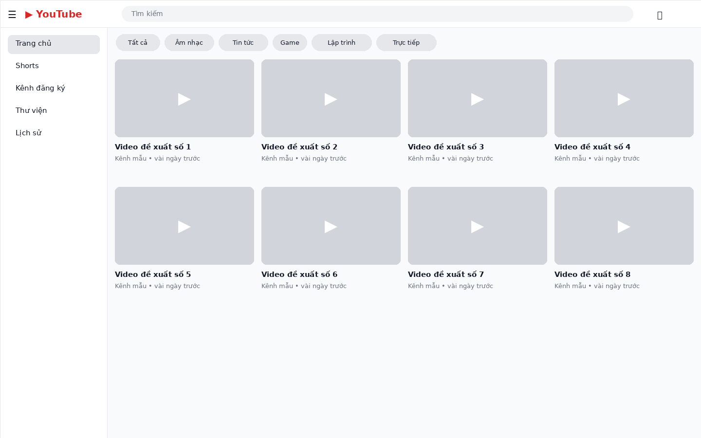
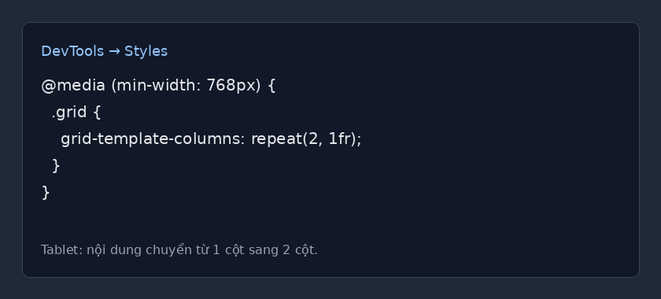
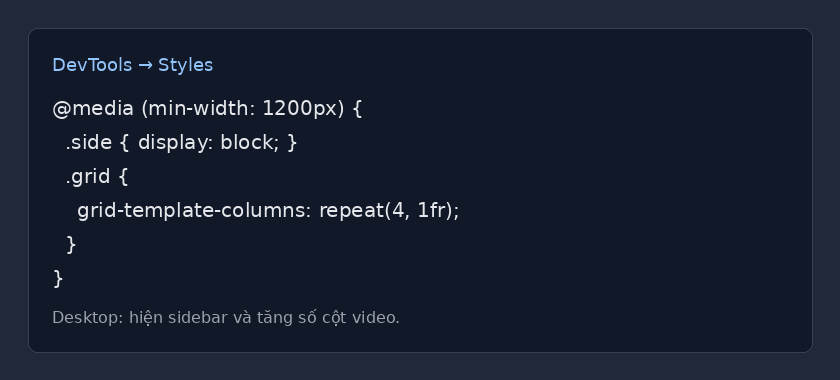

# PBT05 - CSS Responsive & SCSS

## PHẦN A — KIỂM TRA ĐỌC HIỂU

### Câu A1 — Viewport & Mobile-First

Thẻ meta viewport chuẩn:

```html
<meta name="viewport" content="width=device-width, initial-scale=1.0">
```

- `width=device-width`: chiều rộng trang bằng chiều rộng thiết bị.
- `initial-scale=1.0`: mức zoom ban đầu là 100%.

Nếu thiếu thẻ viewport, iPhone thường hiển thị trang như bản desktop thu nhỏ. Nội dung bị nhỏ, người dùng phải zoom để đọc.

Mobile-First: viết CSS mặc định cho mobile trước, sau đó dùng `min-width` để mở rộng lên tablet và desktop.

```css
.box {
    width: 100%;
}

@media (min-width: 768px) {
    .box {
        width: 50%;
    }
}
```

Desktop-First: viết CSS mặc định cho desktop trước, sau đó dùng `max-width` để thu nhỏ xuống mobile.

```css
.box {
    width: 50%;
}

@media (max-width: 767px) {
    .box {
        width: 100%;
    }
}
```

Mobile-First được khuyên dùng vì phần lớn người dùng truy cập bằng điện thoại, CSS gọn hơn và dễ tối ưu hiệu năng trên màn hình nhỏ.

### Câu A2 — Breakpoints

| Breakpoint | Kích thước | Thiết bị đại diện | Lưới sản phẩm |
|---|---:|---|---:|
| XS | < 576px | Điện thoại nhỏ | 1 cột |
| SM | ≥ 576px | Điện thoại ngang | 1-2 cột |
| MD | ≥ 768px | Tablet | 2 cột |
| LG | ≥ 992px | Laptop nhỏ | 3 cột |
| XL | ≥ 1200px | Desktop | 4 cột |
| XXL | ≥ 1400px | Màn hình lớn | 4-5 cột |

### Câu A3 — Media Queries

| Chiều rộng màn hình | `.container` width |
|---:|---:|
| 375px | 100% |
| 600px | 540px |
| 800px | 720px |
| 1000px | 960px |
| 1400px | 1140px |

### Câu A4 — SCSS Basics

Variables:

```scss
$primary-color: #2563eb;

button {
    background: $primary-color;
}
```

Nesting:

```scss
.card {
    padding: 16px;

    .card-title {
        font-size: 20px;
    }
}
```

Mixins:

```scss
@mixin flex-center {
    display: flex;
    align-items: center;
    justify-content: center;
}

.header {
    @include flex-center;
}
```

Extend:

```scss
.btn-base {
    padding: 10px 16px;
    border-radius: 8px;
}

.btn-primary {
    @extend .btn-base;
    background: blue;
}
```

Trình duyệt không đọc trực tiếp file `.scss` vì trình duyệt chỉ hiểu HTML, CSS và JavaScript. Cần biên dịch SCSS sang CSS.

Lệnh compile:

```bash
sass scss/style.scss scss/style.css
```

---

## PHẦN B — THỰC HÀNH CODE

### Bài B1 — Responsive Product Page

File đã làm:

- `responsive.html`
- `responsive.css`

Ảnh chụp responsive:







### Bài B2 — CSS Transitions & Animations

File đã làm:

- `animations.html`
- `animations.css`

5 hiệu ứng đã có:

- Card hover nâng lên và tăng shadow.
- Button hover đổi màu và scale.
- Image zoom khi hover.
- Loading spinner bằng `@keyframes spin`.
- Fade-in bằng `@keyframes fadeIn`.



### Bài B3 — SCSS Refactor

Cấu trúc file:

```text
scss/
├── _variables.scss
├── _mixins.scss
├── _components.scss
├── style.scss
└── style.css
```

Lệnh compile:

```bash
sass scss/style.scss scss/style.css
```

---

## PHẦN C — PHÂN TÍCH

### Câu C1 — Phân tích trang web thực

Trang chọn: YouTube.

Ảnh chụp 3 kích thước:







Phân tích:

| Nội dung | Mobile 375px | Tablet 768px | Desktop 1440px |
|---|---|---|---|
| Navigation | Thu gọn, ưu tiên icon | Hiện nhiều icon hơn | Có sidebar và thanh menu đầy đủ |
| Lưới content | 1 cột video | 2 cột video | 4 cột video |
| Element bị ẩn | Sidebar, nhiều chữ menu | Một phần sidebar | Hầu như hiển thị đầy đủ |
| Font size | Nhỏ hơn | Trung bình | Rộng hơn, dễ đọc hơn |

Media queries tìm được:





### Câu C2 — Thiết kế Responsive Strategy

Mobile:

```text
┌────────────────────┐
│ Logo + Hotline     │
├────────────────────┤
│ Hero image         │
├────────────────────┤
│ Form đặt bàn       │
├────────────────────┤
│ Grid món ăn 1 cột  │
├────────────────────┤
│ Google Maps        │
├────────────────────┤
│ Footer             │
└────────────────────┘
```

Mobile ẩn bớt menu dài, chỉ giữ logo và số điện thoại. Form đặt bàn nằm ngay dưới hero để người dùng thao tác nhanh.

Tablet:

```text
┌────────────────────────────┐
│ Logo + Hotline + Menu      │
├────────────────────────────┤
│ Hero image                 │
├────────────────────────────┤
│ Form đặt bàn               │
├────────────────────────────┤
│ Grid món ăn 2 cột          │
├────────────────────────────┤
│ Google Maps                │
├────────────────────────────┤
│ Footer                     │
└────────────────────────────┘
```

Tablet dùng grid món ăn 2 cột. Bản đồ nằm dưới form và grid ảnh.

Desktop:

```text
┌────────────────────────────────────┐
│ Logo + Hotline + Menu ngang        │
├────────────────────────────────────┤
│ Hero image toàn chiều ngang        │
├───────────────┬────────────────────┤
│ Form đặt bàn  │ Google Maps        │
├───────────────┴────────────────────┤
│ Grid món ăn 3 cột                  │
├────────────────────────────────────┤
│ Footer                             │
└────────────────────────────────────┘
```

Desktop dùng layout 2 cột cho form và bản đồ. Không cần sidebar riêng vì nội dung chính đã rõ ràng.

CSS skeleton:

```css
* {
    box-sizing: border-box;
}

body {
    margin: 0;
    font-family: Arial, sans-serif;
}

.header,
.hero,
.footer {
    padding: 16px;
}

.food-grid {
    display: grid;
    grid-template-columns: 1fr;
    gap: 16px;
}

.booking-layout {
    display: grid;
    grid-template-columns: 1fr;
    gap: 16px;
    padding: 16px;
}

.map iframe {
    width: 100%;
    height: 300px;
}

@media (min-width: 768px) {
    .food-grid {
        grid-template-columns: repeat(2, 1fr);
    }
}

@media (min-width: 1024px) {
    .booking-layout {
        grid-template-columns: 1fr 1fr;
    }

    .food-grid {
        grid-template-columns: repeat(3, 1fr);
    }
}
```
