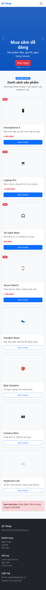
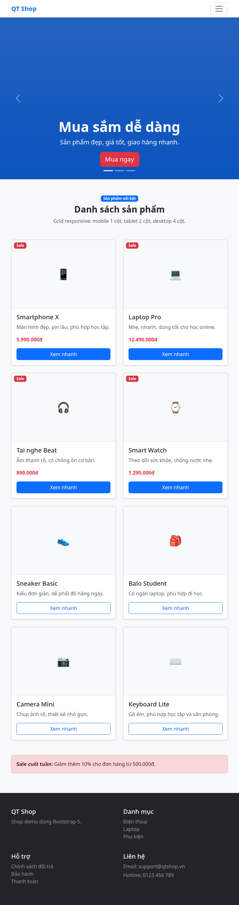
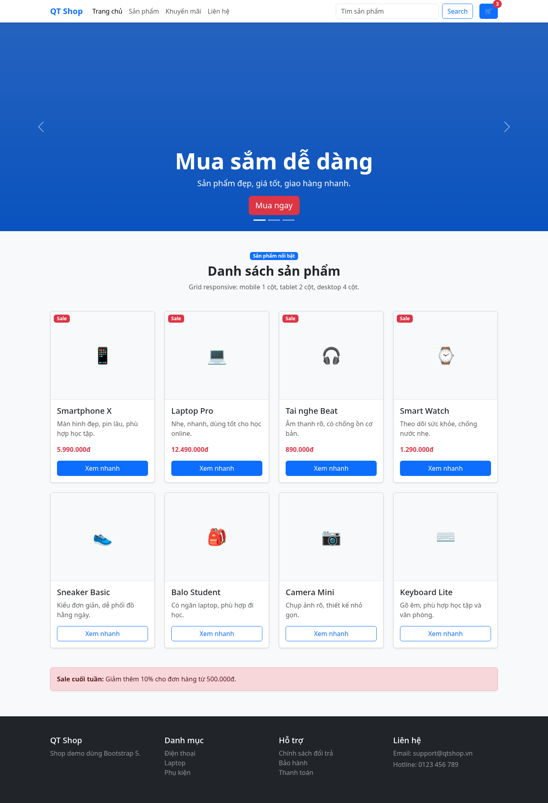
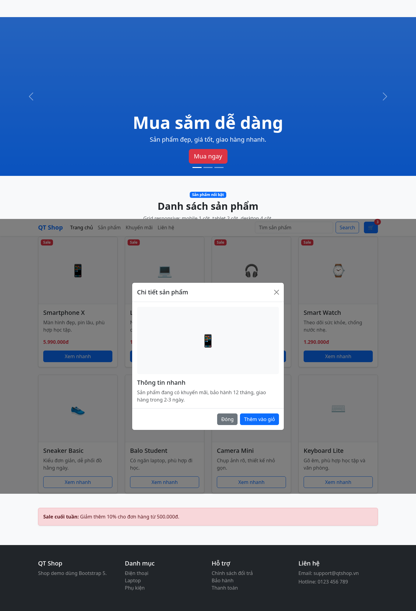
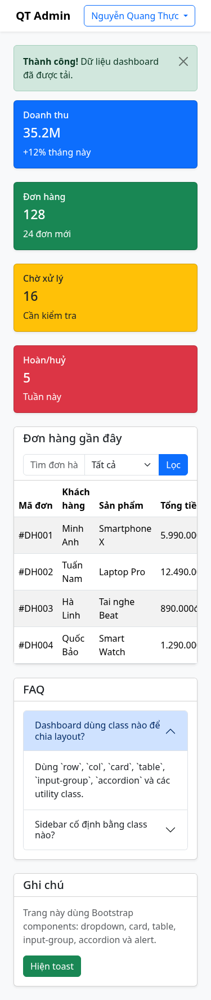
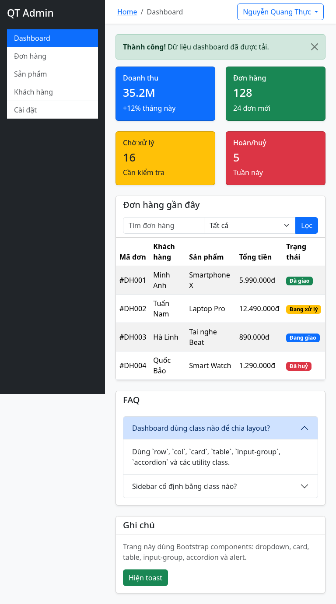
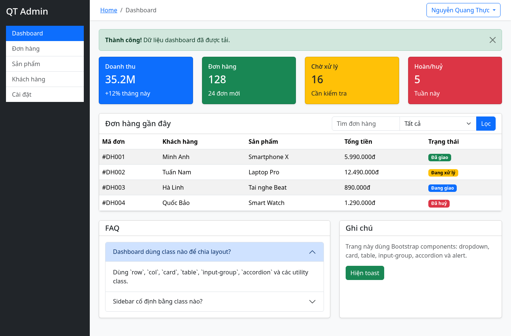

# PBT06 - CSS Frameworks: Bootstrap 5

## PHẦN A - ĐỌC HIỂU

### Câu A1 - Grid System

| Kích thước màn hình | Số cột | Layout |
|---|---:|---|
| `< 768px` | 1 cột | Box 1, 2, 3, 4 xếp dọc |
| `768px - 991px` | 2 cột | Mỗi hàng có 2 box |
| `>= 992px` | 4 cột | 4 box nằm trên cùng 1 hàng |

```text
< 768px:
[Box 1]
[Box 2]
[Box 3]
[Box 4]

768px - 991px:
[Box 1] [Box 2]
[Box 3] [Box 4]

>= 992px:
[Box 1] [Box 2] [Box 3] [Box 4]
```

`col-md-6` nghĩa là từ màn hình `md` trở lên, box chiếm 6/12 cột, tức 50% chiều rộng.

Không cần viết `col-sm-12` vì đã có `col-12`. Khi màn hình nhỏ hơn `md`, mỗi box chiếm đủ 12/12 cột.

### Câu A2 - Utilities & Components

`d-none d-md-block`:

| Kích thước | Trạng thái |
|---|---|
| `< 768px` | Ẩn |
| `>= 768px` | Hiện dạng block |

5 spacing utilities:

| Class | Ý nghĩa |
|---|---|
| `mt-3` | margin-top mức 3 |
| `mb-4` | margin-bottom mức 4 |
| `ms-2` | margin-left/start mức 2 |
| `px-4` | padding trái và phải mức 4 |
| `py-3` | padding trên và dưới mức 3 |

Khác nhau giữa container:

| Class | Ý nghĩa |
|---|---|
| `.container` | Có max-width theo breakpoint, nội dung căn giữa |
| `.container-fluid` | Luôn rộng 100% màn hình |
| `.container-md` | Dưới `md` rộng 100%, từ `md` trở lên có max-width |

---

## PHẦN B - THỰC HÀNH

### Bài B1 - Landing Page Bootstrap

File: `bootstrap_landing.html`

Ảnh responsive:

**Mobile 375px**



**Tablet 768px**



**Desktop 1200px**



**Modal Xem nhanh**



### Bài B2 - Dashboard Layout

File: `bootstrap_dashboard.html`

Ảnh responsive:

**Mobile 375px**



**Tablet 768px**



**Desktop 1200px**



---

## PHẦN C - PHÂN TÍCH

### Câu C1 - Tùy biến Bootstrap

Muốn đổi màu `$primary` sang `#E63946`:

1. Cài SASS hoặc dùng project có Bootstrap source.
2. Tạo file `custom.scss`.
3. Khai báo biến trước khi import Bootstrap.

```scss
$primary: #E63946;
@import "bootstrap/scss/bootstrap";
```

4. Compile `custom.scss` ra file CSS.
5. Link file CSS mới vào HTML.

Không nên sửa trực tiếp:

```css
.btn-primary {
    background: red;
}
```

Vì cách này chỉ sửa một class riêng lẻ, dễ thiếu `hover`, `active`, `focus`, `border`. Dùng SASS variables giúp màu được áp dụng đồng bộ cho button, badge, alert, link và các component khác.

### Câu C2 - So sánh CSS thuần và Bootstrap

CSS thuần tạo navbar responsive và product card:

```css
.navbar {
    display: flex;
    justify-content: space-between;
    align-items: center;
    padding: 16px 40px;
    background: #fff;
    box-shadow: 0 2px 10px rgba(0,0,0,0.08);
}

.nav-menu {
    display: flex;
    gap: 24px;
    list-style: none;
}

.nav-menu a {
    text-decoration: none;
    color: #222;
}

.product-card {
    border: 1px solid #ddd;
    border-radius: 12px;
    overflow: hidden;
    box-shadow: 0 4px 12px rgba(0,0,0,0.08);
}

.product-card img {
    width: 100%;
    height: 220px;
    object-fit: cover;
}

.product-card-body {
    padding: 16px;
}

.product-card button {
    padding: 10px 16px;
    border: none;
    border-radius: 8px;
    background: #0d6efd;
    color: white;
}

@media (max-width: 768px) {
    .navbar {
        flex-direction: column;
        gap: 16px;
    }

    .nav-menu {
        flex-direction: column;
        align-items: center;
    }
}
```


