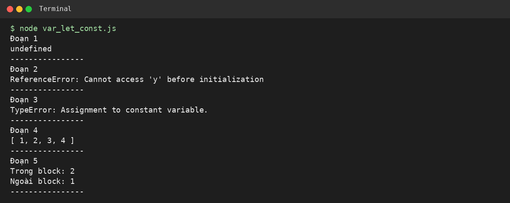
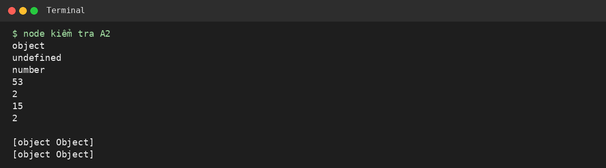
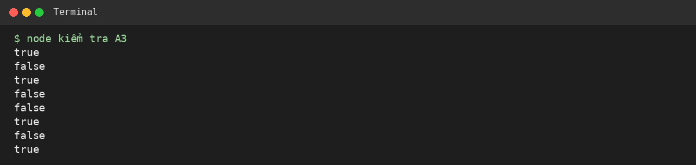
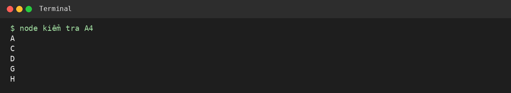
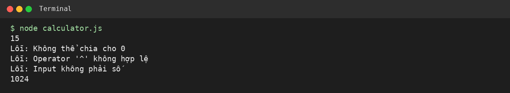
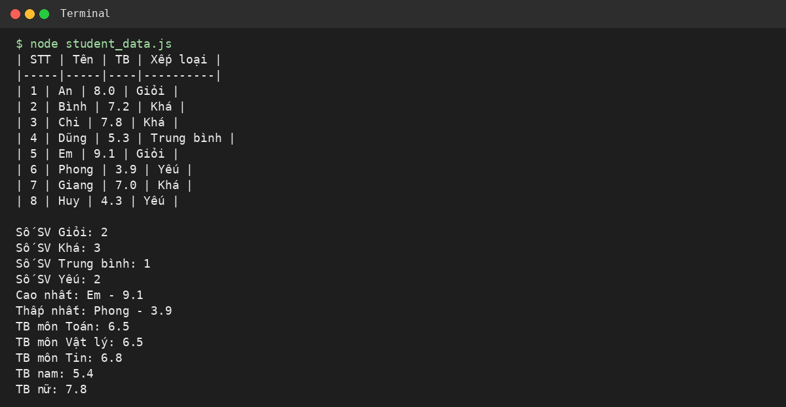
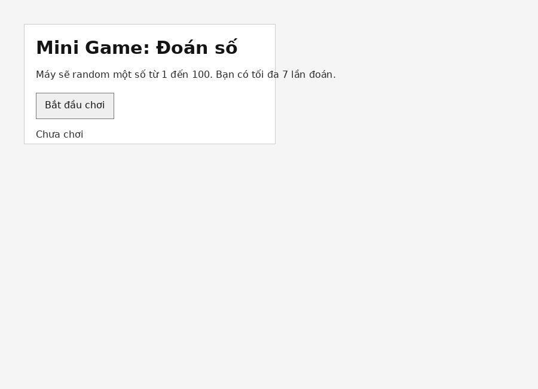
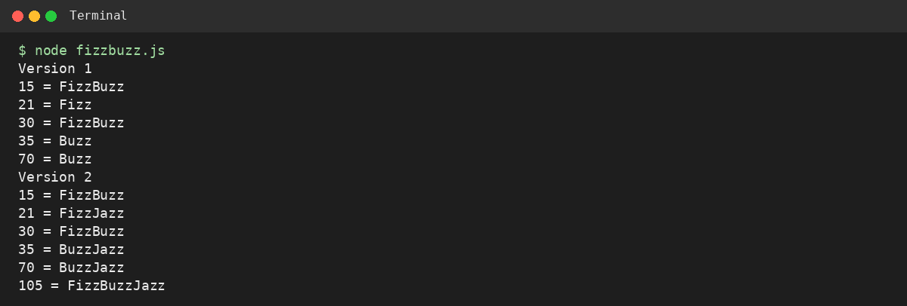
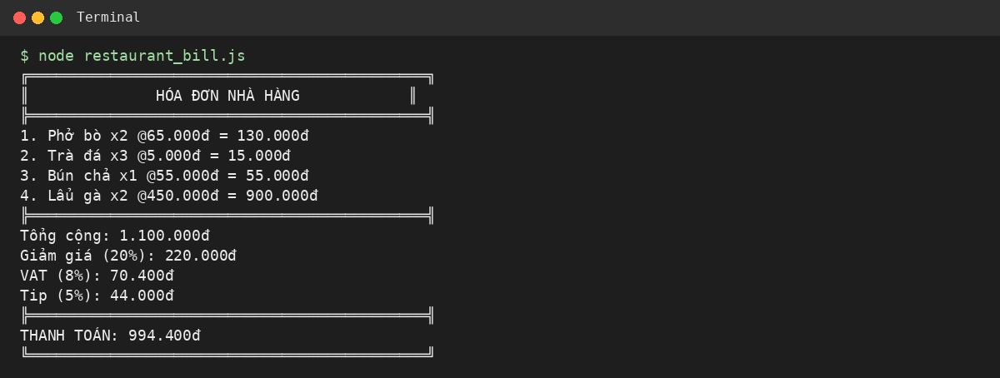

# PHIẾU BÀI TẬP 07

Sinh viên: Nguyễn Quang Thực

## PHẦN A — KIỂM TRA ĐỌC HIỂU

### Câu A1 — var / let / const

| Đoạn | Dự đoán | Kết quả sau khi chạy | Nhận xét |
|---|---|---|---|
| 1 | `undefined` | `undefined` | `var` bị hoisting, biến được đưa lên đầu nhưng chưa có giá trị. |
| 2 | `ReferenceError` | `ReferenceError` | `let` cũng có hoisting nhưng nằm trong TDZ nên không dùng trước khi khai báo được. |
| 3 | `TypeError` | `TypeError` | `const` không được gán lại giá trị mới. |
| 4 | `[1, 2, 3, 4]` | `[1, 2, 3, 4]` | `const` không cho gán lại biến, nhưng mảng vẫn có thể thay đổi phần tử. |
| 5 | Trong block: `2`, ngoài block: `1` | Trong block: `2`, ngoài block: `1` | `let` có phạm vi theo block. |



### Câu A2 — Data Types & Coercion

| Code | Dự đoán / kết quả |
|---|---|
| `typeof null` | `object` |
| `typeof undefined` | `undefined` |
| `typeof NaN` | `number` |
| `"5" + 3` | `53` |
| `"5" - 3` | `2` |
| `"5" * "3"` | `15` |
| `true + true` | `2` |
| `[] + []` | chuỗi rỗng |
| `[] + {}` | `[object Object]` |
| `{} + []` | `[object Object]` |

`"5" + 3` ra `53` vì toán tử `+` có thể nối chuỗi. `"5" - 3` ra `2` vì toán tử `-` ép dữ liệu về số.



### Câu A3 — So sánh == vs ===

| Code | Kết quả |
|---|---|
| `5 == "5"` | `true` |
| `5 === "5"` | `false` |
| `null == undefined` | `true` |
| `null === undefined` | `false` |
| `NaN == NaN` | `false` |
| `0 == false` | `true` |
| `0 === false` | `false` |
| `"" == false` | `true` |

Từ giờ nên dùng `===` vì so sánh chặt chẽ cả giá trị và kiểu dữ liệu, tránh lỗi do ép kiểu tự động.



### Câu A4 — Truthy & Falsy

Các giá trị falsy trong JavaScript: `false`, `0`, `-0`, `0n`, `""`, `null`, `undefined`, `NaN`. Trong browser còn có trường hợp đặc biệt là `document.all`.

| Code | Có in không? |
|---|---|
| `if ("0") console.log("A")` | Có in `A` |
| `if ("") console.log("B")` | Không in |
| `if ([]) console.log("C")` | Có in `C` |
| `if ({}) console.log("D")` | Có in `D` |
| `if (null) console.log("E")` | Không in |
| `if (0) console.log("F")` | Không in |
| `if (-1) console.log("G")` | Có in `G` |
| `if (" ") console.log("H")` | Có in `H` |



### Câu A5 — Template Literals

```js
var greeting = `Xin chào ${name}! Bạn ${age} tuổi.`;
```

```js
var url = `https://api.example.com/users/${userId}/orders?page=${page}`;
```

```js
var html = `
<div class="card">
    <h2>${title}</h2>
    <p>${description}</p>
    <span>Giá: ${price}đ</span>
</div>`;
```

## PHẦN B — THỰC HÀNH CODE

### Bài B1 — Máy tính đơn giản

File: `calculator.js`



### Bài B2 — Xử lý dữ liệu sinh viên

File: `student_data.js`



### Bài B3 — Mini Game: Đoán số

File: `guess_number.html`, `guess.js`



### Bài B4 — FizzBuzz nâng cao

File: `fizzbuzz.js`



## PHẦN C — SUY LUẬN

### Câu C1 — Debug JavaScript

Các lỗi em tìm được:

| Lỗi | Cách sửa |
|---|---|
| `giaBan` truyền vào là chuỗi `"100000"` | Truyền số `100000` hoặc ép kiểu bằng `Number()` |
| Chưa kiểm tra `giaBan` có phải số không | Thêm kiểm tra `typeof giaBan !== "number"` |
| Chưa kiểm tra `phanTramGiam` có phải số không | Thêm kiểm tra kiểu dữ liệu |
| `if (giaSauGiam = 0)` dùng phép gán | Sửa thành `if (giaSauGiam === 0)` |
| Dùng `var` trong vòng lặp với `setTimeout` | Sửa `var i` thành `let i` |
| Với `var`, các hàm trong `setTimeout` dùng chung một biến `i` | `let` tạo biến riêng cho từng vòng lặp |
| Nên dùng `const` cho biến không gán lại | Đổi `giamGia`, `giaSauGiam` sang `const` |
| Chưa xử lý giá bán âm | Thêm điều kiện `giaBan < 0` |

Code sau khi sửa:

```js
function tinhGiaGiamGia(giaBan, phanTramGiam) {
    if (typeof giaBan !== "number" || Number.isNaN(giaBan) || giaBan < 0) {
        return "Giá bán không hợp lệ";
    }

    if (typeof phanTramGiam !== "number" || Number.isNaN(phanTramGiam) || phanTramGiam < 0 || phanTramGiam > 100) {
        return "Phần trăm giảm không hợp lệ";
    }

    const giamGia = giaBan * phanTramGiam / 100;
    const giaSauGiam = giaBan - giamGia;

    if (giaSauGiam === 0) {
        console.log("Sản phẩm miễn phí!");
    }

    return giaSauGiam;
}

const gia = tinhGiaGiamGia(100000, 20);
console.log("Giá sau giảm: " + gia + "đ");

const gia2 = tinhGiaGiamGia(50000, 110);
console.log("Giá: " + gia2);

for (let i = 0; i < 5; i++) {
    setTimeout(function () {
        console.log("Item " + i);
    }, 1000);
}
```

### Câu C2 — Bài toán thực tế

File: `restaurant_bill.js`


