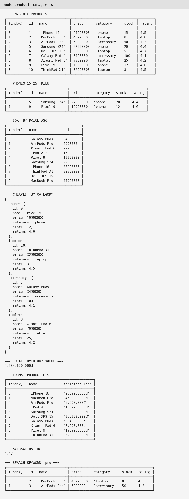
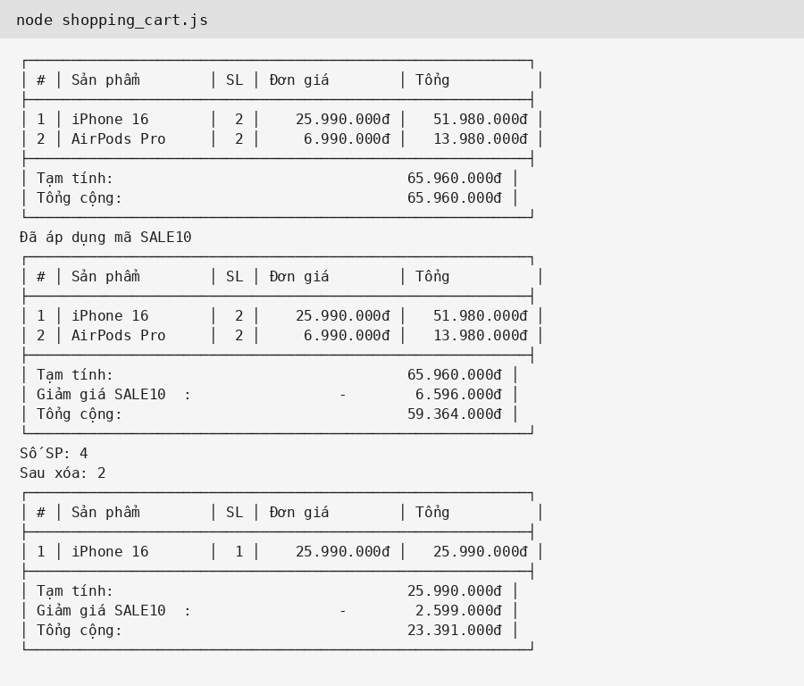
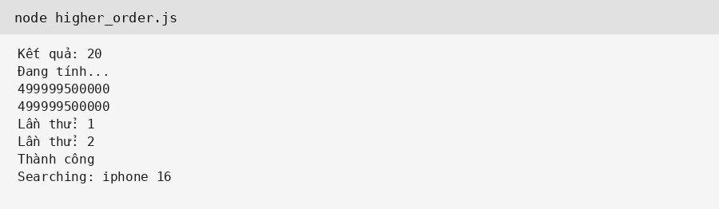
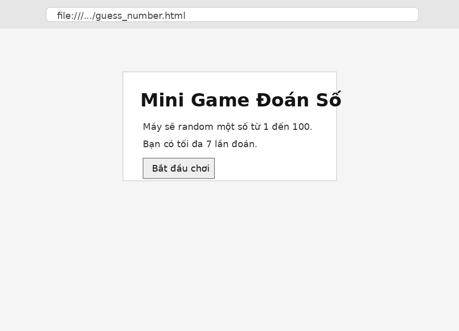

# PHIẾU BÀI TẬP 08

Sinh viên: Nguyễn Quang Thực

## PHẦN A

### Câu A1

Function Declaration:

```js
function tinhThueBaoHiem(luong) {
    const thuong = luong > 11000000 ? luong * 0.1 : 0;
    return { thuong, thuc_nhan: luong - thuong };
}
```

Function Expression:

```js
const tinhThueBaoHiem2 = function(luong) {
    const thuong = luong > 11000000 ? luong * 0.1 : 0;
    return { thuong, thuc_nhan: luong - thuong };
};
```

Arrow Function:

```js
const tinhThueBaoHiem3 = luong => {
    const thuong = luong > 11000000 ? luong * 0.1 : 0;
    return { thuong, thuc_nhan: luong - thuong };
};
```

Khác nhau về hoisting:

```js
console.log(tinhThueBaoHiem(12000000));

function tinhThueBaoHiem(luong) {
    const thuong = luong > 11000000 ? luong * 0.1 : 0;
    return { thuong, thuc_nhan: luong - thuong };
}
```

Kết quả: chạy được vì Function Declaration được hoisting.

```js
console.log(tinhThueBaoHiem2(12000000));

const tinhThueBaoHiem2 = function(luong) {
    const thuong = luong > 11000000 ? luong * 0.1 : 0;
    return { thuong, thuc_nhan: luong - thuong };
};
```

Kết quả: lỗi ReferenceError vì biến dùng `const` chưa được khởi tạo.

```js
console.log(tinhThueBaoHiem3(12000000));

const tinhThueBaoHiem3 = luong => {
    const thuong = luong > 11000000 ? luong * 0.1 : 0;
    return { thuong, thuc_nhan: luong - thuong };
};
```

Kết quả: lỗi ReferenceError vì Arrow Function đang được gán vào biến `const`.

### Câu A2

Đoạn 1:

```txt
1
2
3
2
2
```

Giải thích: `count` nằm trong hàm `counter`, các hàm con vẫn nhớ và thay đổi được biến đó nhờ closure.

Đoạn 2:

```txt
var: 3
var: 3
var: 3
let: 0
let: 1
let: 2
```

Giải thích: `var` dùng chung một biến `i`, khi `setTimeout` chạy thì vòng lặp đã xong nên `i = 3`. `let` tạo biến mới cho từng vòng lặp nên giữ được giá trị 0, 1, 2.

### Câu A3

```js
const nums = [1, 2, 3, 4, 5, 6, 7, 8, 9, 10];

nums.filter(n => n % 2 === 0);
nums.map(n => n * 3);
nums.reduce((sum, n) => sum + n, 0);
nums.find(n => n > 7);
nums.some(n => n > 10);
nums.every(n => n > 0);
nums.map(n => `Số ${n} là ${n % 2 === 0 ? "chẵn" : "lẻ"}`);
[...nums].reverse();
```

Kết quả:

```txt
[2, 4, 6, 8, 10]
[3, 6, 9, 12, 15, 18, 21, 24, 27, 30]
55
8
false
true
["Số 1 là lẻ", "Số 2 là chẵn", ...]
[10, 9, 8, 7, 6, 5, 4, 3, 2, 1]
```

### Câu A4

```txt
iPhone 16 25990000 8 Titan
ReferenceError: specs is not defined
23990000
true
25990000
16
```

Giải thích: dòng destructuring chỉ lấy `ram` và `color` trong `specs`, không tạo biến tên `specs`. Spread object chỉ copy nông nên `copy.specs` vẫn trỏ đến object con ban đầu, sửa `copy.specs.ram` thì `product.specs.ram` cũng đổi thành 16.

## PHẦN C

### Câu C1

```js
const processOrders = orders => orders
    .filter(({ status, total }) => status === "completed" && total > 100000)
    .map(({ id, customer, total }) => ({ id, customer, total, discount: total * 0.1, finalTotal: total * 0.9 }))
    .sort((a, b) => b.finalTotal - a.finalTotal);
```

Em dùng `filter` để lọc đơn đã hoàn thành và tổng tiền trên 100000, dùng `map` để tạo object mới, dùng `sort` để sắp xếp `finalTotal` giảm dần.

### Câu C2

```js
const miniArray = {
    map(arr, fn) {
        const result = [];
        for (let i = 0; i < arr.length; i++) {
            result.push(fn(arr[i], i, arr));
        }
        return result;
    },
    filter(arr, fn) {
        const result = [];
        for (let i = 0; i < arr.length; i++) {
            if (fn(arr[i], i, arr)) result.push(arr[i]);
        }
        return result;
    },
    reduce(arr, fn, initialValue) {
        if (arr.length === 0 && arguments.length < 3) throw new TypeError("Reduce of empty array with no initial value");
        let result = arguments.length >= 3 ? initialValue : arr[0];
        let start = arguments.length >= 3 ? 0 : 1;
        for (let i = start; i < arr.length; i++) {
            result = fn(result, arr[i], i, arr);
        }
        return result;
    }
};

console.log(miniArray.map([1, 2, 3], x => x * 2));
console.log(miniArray.filter([1, 2, 3, 4], x => x > 2));
console.log(miniArray.reduce([1, 2, 3, 4], (a, b) => a + b, 0));
```

Kết quả:

```txt
[2, 4, 6]
[3, 4]
10
```

## ẢNH CHỤP MÀN HÌNH

### Chạy `product_manager.js`



### Chạy `shopping_cart.js`



### Chạy `higher_order.js`



### Giao diện `guess_number.html`


