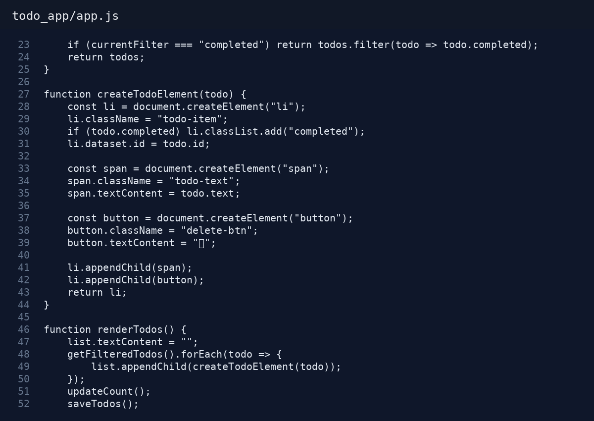
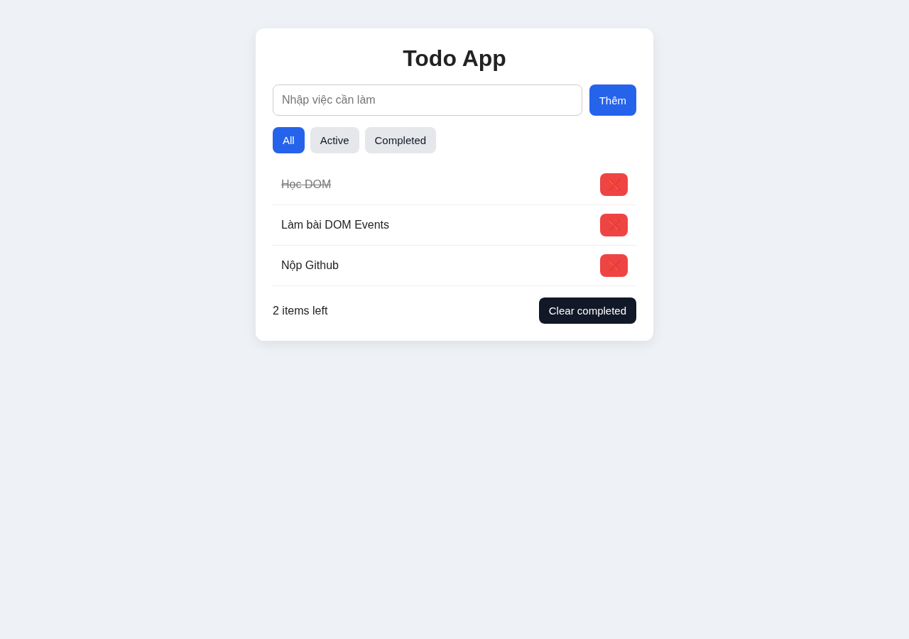
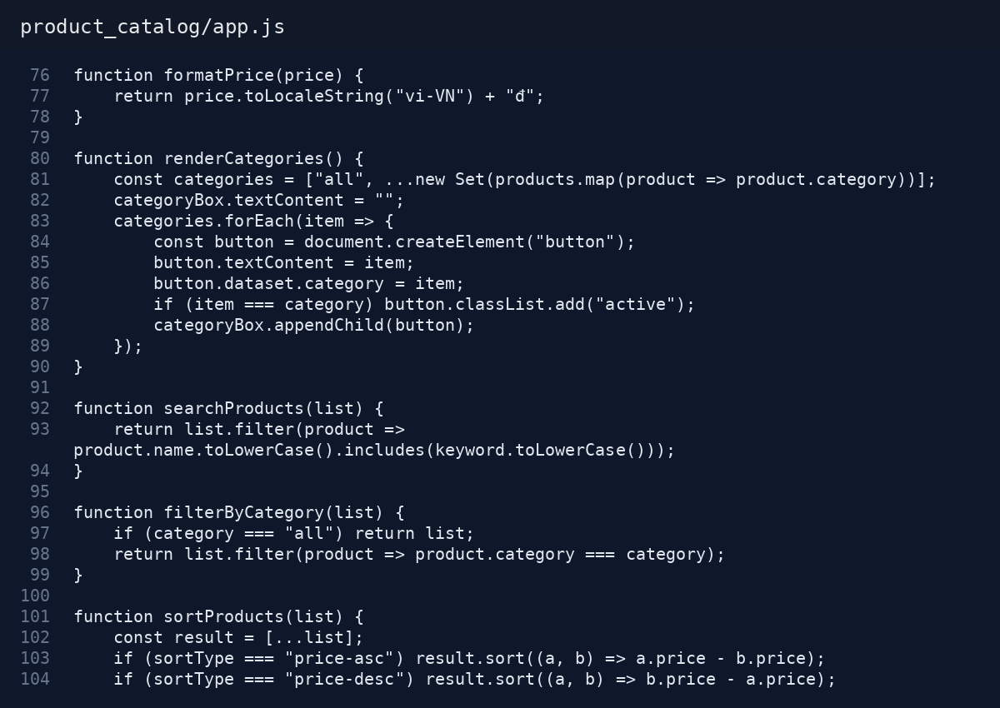
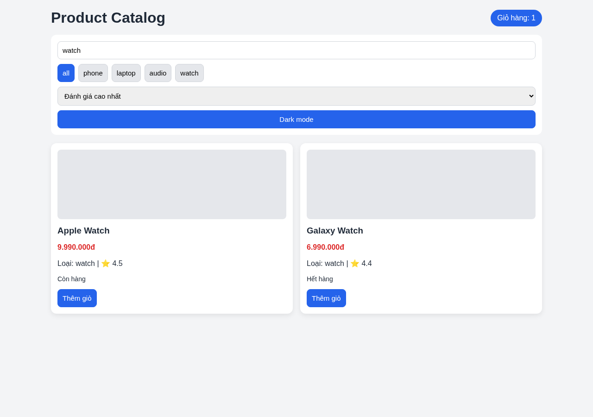
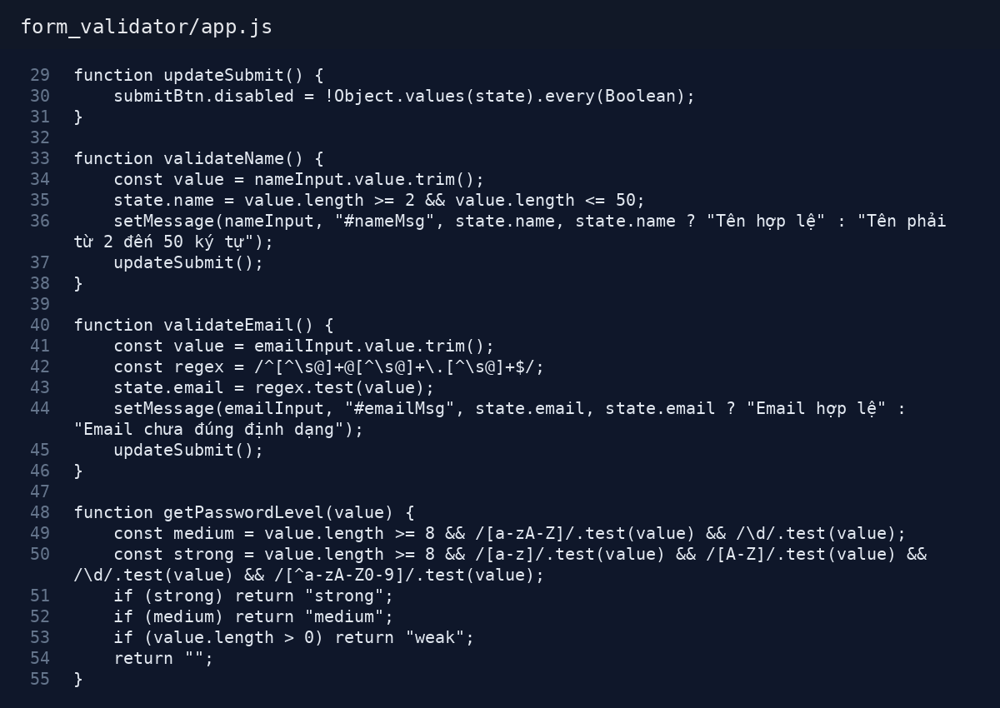
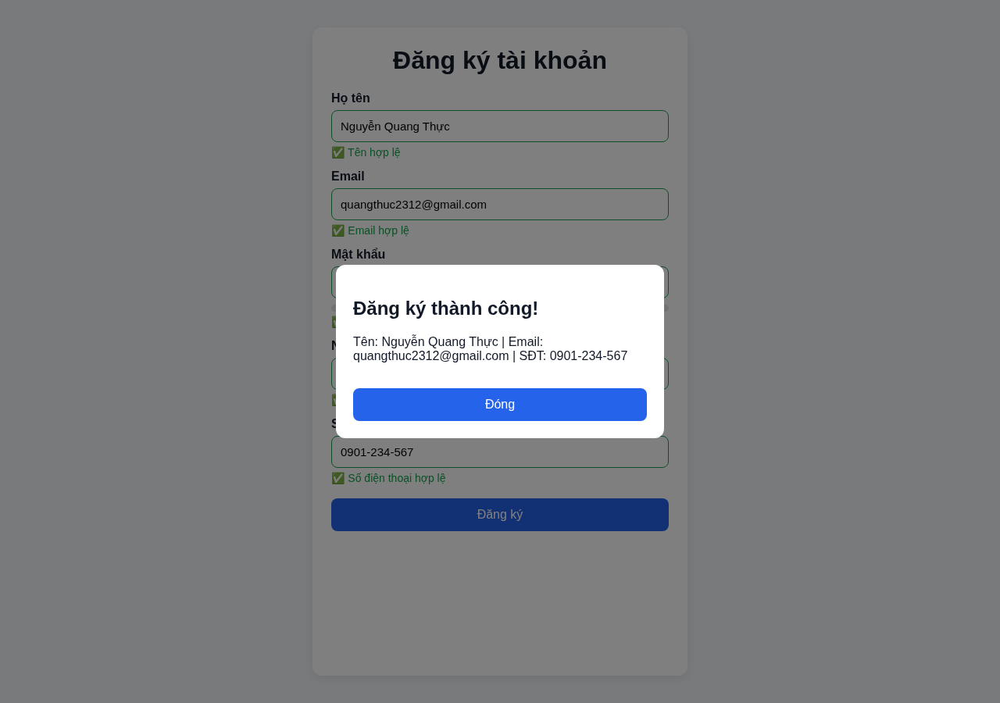
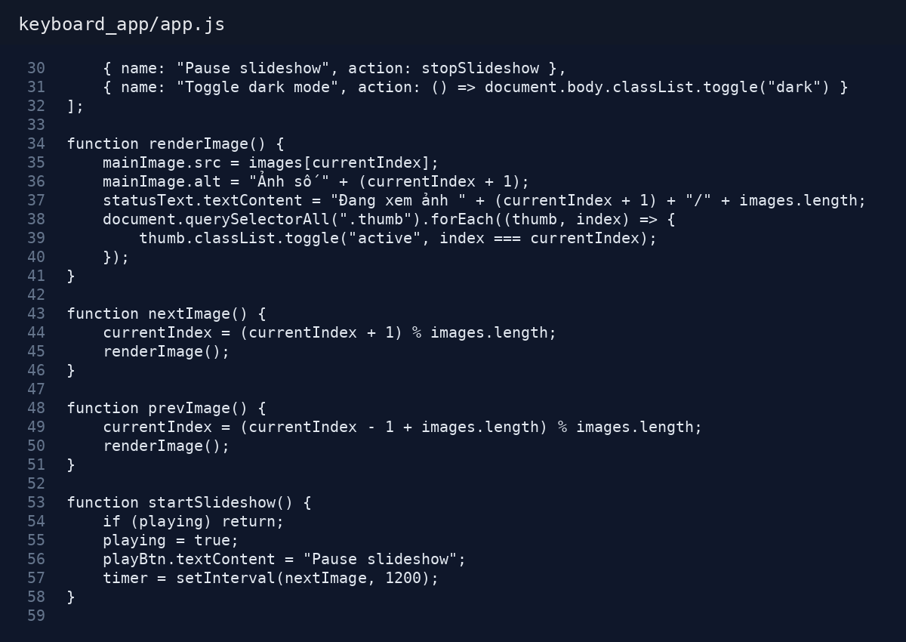
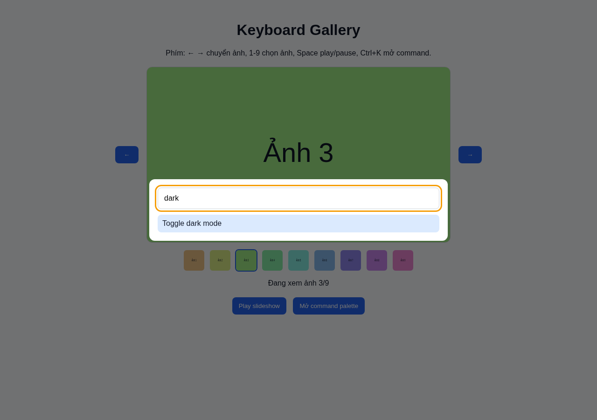

# PHIẾU BÀI TẬP 09 - DOM MANIPULATION & EVENTS

## PHẦN A - KIỂM TRA ĐỌC HIỂU

### Câu A1 - DOM Tree

```text
div#app
├── header
│   ├── h1
│   │   └── "Todo App"
│   └── nav
│       ├── a.active
│       │   └── "All"
│       ├── a
│       │   └── "Active"
│       └── a
│           └── "Completed"
└── main
    ├── form#todoForm
    │   ├── input#todoInput[type="text"]
    │   └── button[type="submit"]
    │       └── "Add"
    └── ul#todoList
        ├── li.todo-item
        │   └── "Learn HTML"
        └── li.todo-item.completed
            └── "Learn CSS"
```

| Yêu cầu | querySelector |
|---|---|
| Chọn thẻ h1 | `document.querySelector("h1")` |
| Chọn input trong form | `document.querySelector("#todoForm input")` |
| Chọn tất cả `.todo-item` | `document.querySelectorAll(".todo-item")` |
| Chọn link đang active | `document.querySelector("nav a.active")` |
| Chọn `<li>` đầu tiên trong `#todoList` | `document.querySelector("#todoList li:first-child")` |
| Chọn tất cả `<a>` bên trong `<nav>` | `document.querySelectorAll("nav a")` |

### Câu A2 - innerHTML vs textContent

`innerHTML` dùng để đọc hoặc ghi cả nội dung HTML bên trong một phần tử. Khi gán chuỗi có thẻ HTML, trình duyệt sẽ hiểu và render thành thẻ thật.

```js
document.querySelector("#box").innerHTML = "<b>Xin chào</b>";
```

`textContent` chỉ dùng để đọc hoặc ghi văn bản thuần. Nếu chuỗi có thẻ HTML thì nó vẫn hiện như chữ bình thường.

```js
document.querySelector("#box").textContent = "<b>Xin chào</b>";
```

`innerHTML` có thể gây XSS vì dữ liệu người dùng nhập vào có thể chứa mã HTML hoặc JavaScript độc hại. Ví dụ nguy hiểm:

```js
const userInput = document.querySelector("#search").value;
document.querySelector("#result").innerHTML = userInput;
```

Cách sửa an toàn hơn:

```js
const userInput = document.querySelector("#search").value;
document.querySelector("#result").textContent = userInput;
```

### Câu A3 - Event Bubbling

Khi click vào button, sự kiện chạy từ phần tử con ra phần tử cha nên output là:

```text
BUTTON
INNER
OUTER
```

Nếu bỏ comment `e.stopPropagation()` trong sự kiện của button, output là:

```text
BUTTON
```

## PHẦN B - THỰC HÀNH CODE

### Bài B1 - Todo App hoàn chỉnh





### Bài B2 - Interactive Product Catalog





### Bài B3 - Form Validator





### Bài B4 - Keyboard Shortcuts & Accessibility





## PHẦN C - DEBUG & PHÂN TÍCH

### Câu C1 - Debug DOM Code

Các lỗi tìm được:

1. `countDisplay.innerHTML = count` nên dùng `textContent`.
2. `addEventListener("onclick", ...)` sai, phải là `addEventListener("click", ...)`.
3. `countDisplay = count` sai vì `countDisplay` là phần tử DOM và đang khai báo `const`.
4. `historyList.innerHTML = null` không nên dùng, có thể dùng `replaceChildren()`.
5. `item.remove;` thiếu dấu `()` nên không xóa được item.
6. `localStorage.getItem("count")` trả về string, cần ép kiểu sang number.
7. Có lưu history nhưng chưa render lại history khi load trang.
8. Lưu history bằng `innerHTML` không tốt, nên lưu mảng dữ liệu và render bằng `createElement`.

Code đã sửa:

```js
const countDisplay = document.querySelector(".count");
const historyList = document.getElementById("history");
const incrementBtn = document.querySelector("#incrementBtn");
const decrementBtn = document.querySelector("#decrementBtn");
const resetBtn = document.querySelector("#resetBtn");
const clearHistoryBtn = document.querySelector("#clearHistory");

let count = Number(localStorage.getItem("count")) || 0;
let history = JSON.parse(localStorage.getItem("history")) || [];

function saveData() {
    localStorage.setItem("count", String(count));
    localStorage.setItem("history", JSON.stringify(history));
}

function renderCount() {
    countDisplay.textContent = count;
}

function renderHistory() {
    historyList.replaceChildren();
    history.forEach((text, index) => {
        const li = document.createElement("li");
        li.textContent = text;
        li.dataset.index = index;
        historyList.appendChild(li);
    });
}

function addHistory() {
    history.push("Count changed to " + count);
    renderHistory();
    saveData();
}

incrementBtn.addEventListener("click", () => {
    count++;
    renderCount();
    addHistory();
});

decrementBtn.addEventListener("click", () => {
    count--;
    renderCount();
    addHistory();
});

resetBtn.addEventListener("click", () => {
    count = 0;
    history = [];
    renderCount();
    renderHistory();
    saveData();
});

historyList.addEventListener("click", event => {
    if (event.target.tagName !== "LI") return;
    history.splice(Number(event.target.dataset.index), 1);
    renderHistory();
    saveData();
});

clearHistoryBtn.addEventListener("click", () => {
    history = [];
    renderHistory();
    saveData();
});

renderCount();
renderHistory();
```

### Câu C2 - Performance

Bind event lên 1000 elements riêng lẻ là bad practice vì trình duyệt phải tạo nhiều event listener, tốn bộ nhớ hơn và khó quản lý khi thêm hoặc xóa phần tử. Event Delegation giải quyết bằng cách gắn một listener lên phần tử cha, sau đó dùng `event.target` để biết người dùng click vào phần tử con nào.

Ví dụ:

```js
const list = document.querySelector("#list");

list.addEventListener("click", event => {
    if (!event.target.classList.contains("item")) return;
    console.log(event.target.textContent);
});
```

Refactor bằng `DocumentFragment`:

```js
const fragment = document.createDocumentFragment();

for (let i = 0; i < 1000; i++) {
    const div = document.createElement("div");
    div.textContent = `Item ${i}`;
    fragment.appendChild(div);
}

document.body.appendChild(fragment);
```

Cách này nhanh hơn vì các phần tử được thêm vào fragment trước, sau đó mới append vào DOM thật một lần. Như vậy trình duyệt không phải cập nhật layout 1000 lần liên tục.
